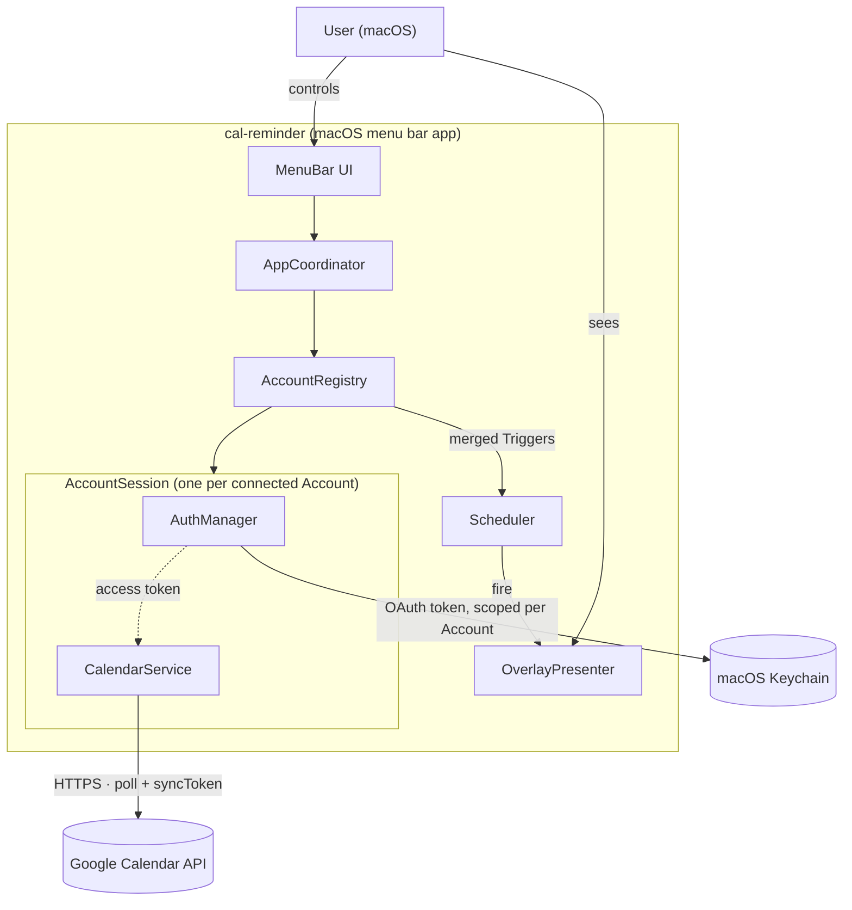

# Architecture overview (C4 — context + containers)

> **Living document.** Depicts the **current** topology: which modules exist and how
> they connect. Update it in the **same edit** that adds/removes a module or
> integration (see `conventions.md` §A.7). Names in **English** (they carry through to
> the code).

## Context (container view)

## Containers (legend)

| Container | Role | Stack |
|-----------|------|-------|
| **cal-reminder** | The whole app; a background menu bar agent that syncs Events and draws the airplane Overlay | Swift 5.9+ · AppKit (`NSStatusItem`, `NSPanel`) · Core Animation · `URLSession`/`Codable` · Keychain Services · Xcode (`LSUIElement` bundle) |
| **Google Calendar API** | Source of Events and Reminders (read-only) | Google Calendar REST v3 · OAuth 2.0 (Desktop/PKCE) |
| **macOS Keychain** | Secure storage of the OAuth refresh token | Keychain Services |

## Components (inside cal-reminder)

| Component | Responsibility | Detailed in |
|-----------|----------------|-------------|
| **MenuBar UI** | `NSStatusItem` menu: status, on/off, test, Accounts submenu (add/reconnect/sign out per Account, Calendar selection per Account), Flight Speed, Banner color, quit | AYD-001, AYD-002, AYD-007 |
| **AppCoordinator** | Wires modules together; holds `AppState`; re-Polls on Calendar-selection changes | AYD-001, AYD-002, AYD-007 |
| **AccountRegistry** | Owns one `AccountSession` per connected Account; fans Poll out across them; handles add/reconnect/sign-out and the legacy single-account migration | AYD-007 |
| **AuthManager** *(one per connected Account)* | OAuth PKCE flow + token refresh + Keychain storage, scoped to its Account | AYD-001, AYD-007 |
| **CalendarService** *(one per connected Account)* | List that Account's Calendars, Poll each selected one (per-Calendar sync), parse Events, resolve Reminders → Triggers | AYD-001, AYD-002, AYD-007 |
| **Scheduler** | Precise local timers per Trigger + dedupe + sleep/wake handling | AYD-001 |
| **OverlayPresenter** | `NSPanel` over all windows + animation + FIFO queue | AYD-001 |

> Diagram and table must stay in sync — if they diverge, **the table wins**.
