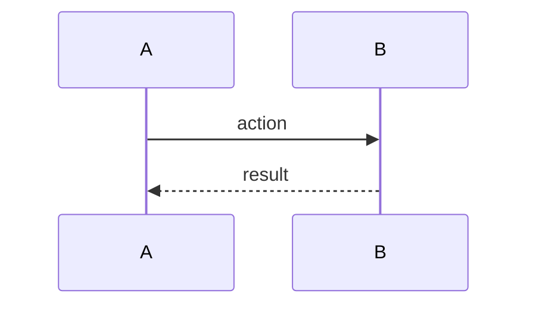

# AYD-NNN: <feature>

> Analysis & Design of a feature. Decides the affected modules/components, the
> **internal interfaces/contracts** between them, the domain model, and the flow.
> It is the source of the design — the SPEC implements, it doesn't redefine. Be objective.
>
> **Append-only** (conventions §A.6): never rewrite a past AYD. When the design changes,
> write a **new AYD that supersedes/overrides** this one (`supersedes` here, `superseded_by`
> there); the old AYD stays frozen as the historical design.

## Goal
_Which requirement (REQ) does this feature meet, and what's the expected outcome._

## Affected modules
| Module | Role in this feature | Generated SPEC |
|--------|----------------------|----------------|
| <module> | _does…_ | SPEC-NNN |

## Interfaces / contract (source of truth)
_Public types, function signatures, data shapes, errors. Names in English (use GLO terms)._
```
<type / signature / payload>
```

## Affected domain model
_Entities/fields (glossary terms)._

## Flow


## Out of scope / open questions
-
