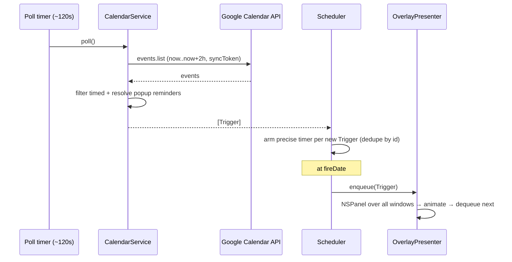

# AYD-001: Airplane event reminders

> Analysis & Design of the core (and only, for the MVP) feature: connect to Google
> Calendar, and at each Event's Reminder time fly an Airplane pulling a Banner across
> the screen, over all windows. Source of the design — the SPECs implement it.

## Goal
Meet **REQ-01 / RF-01..RF-06**: a personal, local macOS menu bar app that reads timed
Events from Google Calendar and, at `Event start − Reminder minutes`, shows a click-through
Overlay of an Airplane pulling a Banner reading `<Title> at HH:MM (in X min)`, above every
window (including fullscreen). Inspiration: the `conniecodes` reel.

## Affected modules
| Module | Role in this feature | Generated SPEC |
|--------|----------------------|----------------|
| OverlayPresenter | Draws the Airplane + Banner over all windows; FIFO queue | SPEC-001 |
| AuthManager | OAuth PKCE flow, token refresh, Keychain storage | SPEC-002 |
| CalendarService | Poll + incremental sync, parse Events, resolve Reminders → Triggers | SPEC-002 |
| Scheduler | Precise local timers per Trigger, dedupe, sleep/wake handling | SPEC-003 |
| MenuBar UI / AppCoordinator | Status, on/off, test, reconnect, quit; wires modules | SPEC-003 |

## Interfaces / contract (source of truth)

**Trigger** — the unit passed from `CalendarService` to `Scheduler`:
```
Trigger {
  id: String            // "<eventId>#<minutes>" — dedupe key (RN-03)
  eventTitle: String
  startDate: Date
  fireDate: Date        // startDate − minutes (RN-02)
  minutesBefore: Int
}
```

**Module boundaries:**
```
AuthManager
  accessToken() async throws -> String     // refreshes on demand (401 → refresh → retry)
  connect() async throws                    // OAuth PKCE, stores refresh token in Keychain
  isConnected: Bool

CalendarService
  poll() async throws -> [Trigger]          // events.list (timeMin=now, timeMax=now+2h,
                                            //   singleEvents=true, syncToken when available)

Scheduler
  schedule(_ triggers: [Trigger])           // (re)arm precise timers, skip already-fired ids
  onFire: (Trigger) -> Void                 // → OverlayPresenter.enqueue

OverlayPresenter
  enqueue(_ trigger: Trigger)               // FIFO; one animation at a time (RN-05)
```

**Reminder resolution (RN-04):** for each Event, if `reminders.useDefault == true` use the
calendar's default reminders (`calendarList.get`); otherwise use `reminders.overrides`.
Keep only `method == "popup"`; emit one Trigger per remaining reminder.

## Affected domain model
- **Event** — timed only (`start.dateTime`); all-day (`start.date`) ignored (RN-01).
- **Reminder** — `{ method: "popup", minutes: Int }`.
- **Trigger** — derived (see contract); not persisted beyond the in-memory dedupe set (MVP).

## Flow



## Key design decisions
- **Native Swift + AppKit** over Electron: the click-through, above-fullscreen Overlay
  (`NSPanel`, `level = .screenSaver`, `collectionBehavior = [.canJoinAllSpaces, .fullScreenAuxiliary]`,
  `ignoresMouseEvents = true`, clear background) is native-only in practice.
- **Hybrid watcher:** a ~120 s poll refreshes the next ~2 h window; each near Trigger gets a
  precise `DispatchSourceTimer`. No public webhook/server needed; second-level precision (RNF-03).
- **Reminders from the Event itself** (not a fixed 5 min): honor each Event's popup reminders.
- **Sleep/wake:** on `NSWorkspace.didWakeNotification`, force re-poll and recompute timers (RNF-04).

## Google setup (one-time, manual by the user)
1. Create a project at console.cloud.google.com and enable the **Google Calendar API**.
2. OAuth consent screen → "External"; add your email as a **test user** (or "Publish app"
   to avoid the 7-day refresh-token expiry in Testing mode).
3. Credentials → **OAuth Client ID** → **Desktop app**.
4. First run: authorize in the browser; the app stores the refresh token in the Keychain.

## macOS considerations
- `Info.plist` with `LSUIElement = true` (menu bar agent, no Dock icon).
- No screen-recording/accessibility permissions needed — the Overlay is our own window; we
  never read other windows' content.
- Optional (v1.1): register as a login item via `SMAppService`.
- Unsigned/un-notarized app runs locally (may need "open anyway" on first launch).

## Implementation roadmap (→ future SPECs)
- **M0 — Skeleton:** Xcode AppKit project, `LSUIElement`, `NSStatusItem` dummy menu.
- **M1 — Overlay (SPEC-001):** `NSPanel` config + Airplane/Banner animation + "test" menu + FIFO queue. Testable without Google.
- **M2 — Google (SPEC-002):** `AuthManager` (OAuth PKCE + Keychain) + `CalendarService` (poll, parse, resolve Reminders).
- **M3 — Scheduling (SPEC-003):** `Scheduler` (precise timers + dedupe + sleep/wake) + real Trigger → Overlay + menu control.
- **M4 — Polish:** on/off, reconnect, error states; optional login item; optional persisted dedupe.

## Out of scope / open questions
- **Out:** publishing/notarization; Event actions (open Meet/Zoom); rich settings UI; multiple
  Google accounts; all-day Events.
- **Open — multi-monitor:** MVP targets `NSScreen.main`; multi-screen behavior TBD.
- **Open — dedupe persistence:** MVP keeps the fired-set in memory; persist across restarts?
- **Open — banner styling:** default is the reel's pink; exact color/speed TBD (hardcoded for now).
