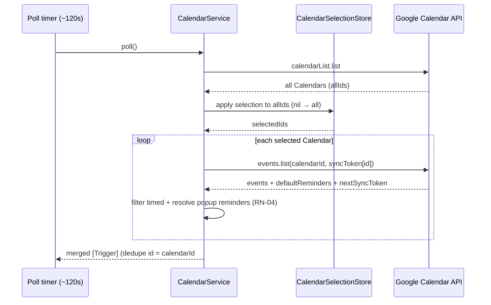
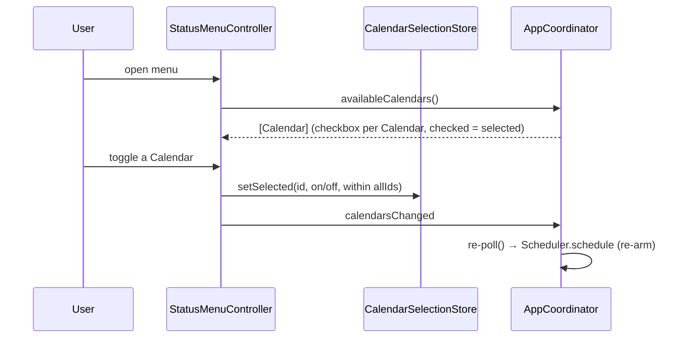

# AYD-002: Calendar selection

> Analysis & Design of reading **every Calendar** in the connected account and letting the
> user **multi-select** which Calendars generate Triggers, from the menu bar. Extends the
> core reminder flow (AYD-001), which today reads only the `primary` Calendar. Source of
> the design — the SPEC implements it.

## Goal
Meet **RF-10** (and the RF-06 menu addition): list all Calendars of the connected account,
let the user pick which ones to be alerted on via a multi-select menu, persist that choice
across restarts, and Poll only the selected Calendars — resolving each Event's popup
Reminders into Triggers exactly as AYD-001 already does. Default when the user has not
chosen: **all Calendars**.

## Affected modules
| Module | Role in this feature | Generated SPEC |
|--------|----------------------|----------------|
| GoogleCalendarAPI | Add `listCalendars()` (`calendarList.list`); parametrize `listEvents` by `calendarId` | SPEC-005 |
| CalendarService | List Calendars, resolve the active selection (nil → all), Poll each selected Calendar with a per-Calendar `syncToken` + `defaultReminders`, tag each Trigger's dedupe key with `calendarId` | SPEC-005 |
| CalendarSelectionStore (new) | Persist the selected Calendar ids outside the Keychain (not a secret), like FlightSpeed/BannerColor | SPEC-005 |
| MenuBar UI / StatusMenuController | "Calendars" submenu: one checkbox per Calendar (multi-select); toggling persists and requests a re-Poll | SPEC-005 |
| AppCoordinator | Expose the account's Calendars to the menu; on a selection change, re-Poll and re-arm the Scheduler | SPEC-005 |

## Interfaces / contract (source of truth)

**Calendar** — the domain view of a `calendarList` entry, passed to the menu:
```
Calendar {
  id: String            // Google calendar id (e.g. "primary", "...@group.calendar.google.com")
  title: String         // Google `summary`
  isPrimary: Bool
}
```

**GoogleCalendarAPIProtocol** (additions / change):
```
listCalendars() async throws -> [GoogleCalendarListEntry]
    // GET calendarList.list; keep entries whose accessRole can read Events
    // (owner | writer | reader); drop freeBusyReader (no Event details).

listEvents(calendarId: String,             // was implicitly "primary"
           timeMin: Date, timeMax: Date,
           syncToken: String?) async throws
    -> (events: [GoogleEvent], nextSyncToken: String?, defaultReminders: [GoogleCalendarDefaultReminder]?)
    // defaultReminders are per-Calendar (RN-04) — they come inline on that Calendar's response.
```

**CalendarSelectionStoring** (new):
```
selectedCalendarIds: Set<String>?          // nil = never chosen → treat as "all" (RF-10 default)
isSelected(_ id: String, within allIds: Set<String>) -> Bool   // nil selection → true for any known id
setSelected(_ id: String, _ selected: Bool, within allIds: Set<String>)
    // first write materializes the current effective set (all) then applies the toggle,
    // so unchecking one Calendar keeps the other four selected.
```

**CalendarService** (public surface — `poll()` signature is unchanged, so PollLoop/Scheduler
are untouched):
```
poll() async throws -> [Trigger]
    // 1. listCalendars() → allIds
    // 2. selected = selection applied to allIds (nil → all)
    // 3. for each selected Calendar: listEvents(calendarId:…, syncToken: tokens[id])
    //    → resolve popup Reminders (RN-04) → Triggers
    // 4. merge; per-Calendar syncToken + defaultReminders cached in dictionaries keyed by id

availableCalendars() async throws -> [Calendar]   // for the menu (maps listCalendars entries)
```

**Trigger dedupe key (RN-03 update):** `"<calendarId>#<eventId>#<minutes>"`. Google Event ids
are unique only within a Calendar, so `calendarId` is prefixed to keep the fired-set globally
unique across Calendars.

## Affected domain model
- **Calendar** *(new glossary term)* — `{ id, title, isPrimary }`; the set of Calendars comes
  from `calendarList.list` on the connected account.
- **Calendar Selection** — the persisted `Set<String>` of selected Calendar ids. `nil` (never
  chosen) is the "all Calendars" default (RF-10). Stored in UserDefaults — not a secret.
- **Trigger** — unchanged shape; only its dedupe `id` now carries `calendarId` (RN-03).
- **Per-Calendar sync state** — CalendarService keeps `syncToken` and cached `defaultReminders`
  **per `calendarId`** (were single-valued in AYD-001). A newly selected Calendar simply starts
  with no token → full-window fetch on its first Poll.

## Flow

**Poll (selected Calendars → Triggers):**


**Selection change (menu → re-poll):**


## Key design decisions
- **`poll()` signature stays the same** — selection resolution lives inside CalendarService,
  so the Scheduler/PollLoop wiring from AYD-001/SPEC-003 is untouched (minimal blast radius).
- **List Calendars every Poll** (it is a small, cheap call) rather than caching a stale list.
  This also lets the "all" default and the menu reflect newly added/removed Calendars without
  a reconnect. `calendarList` incremental sync (`syncToken`) is a later optimization.
- **Default = all Calendars, materialized on first toggle.** `nil` means "all"; the first menu
  toggle writes the explicit set (all minus/plus the toggled id) so intent is preserved even if
  the account's Calendar set later changes.
- **`calendarId` in the dedupe key** keeps RN-03 correct across Calendars.
- **Stale selected ids are harmless** — an id for a removed/unshared Calendar just never appears
  in `allIds`, so it is silently skipped.

## Out of scope / open questions
- **Out:** per-Calendar Flight Speed / Banner color; showing each Calendar's Google color in the
  menu; `calendarList` incremental sync; multiple Google accounts (still out — AYD-001).
- **Open — menu refresh:** rebuild the "Calendars" submenu on `menuWillOpen` vs. after each
  connect/Poll. Lean toward `menuWillOpen` so the list is always current; SPEC to confirm.
- **Open — many Calendars:** with N selected Calendars a Poll makes N `events.list` calls; fine
  for a personal account (~5), revisit batching only if it becomes a problem.
