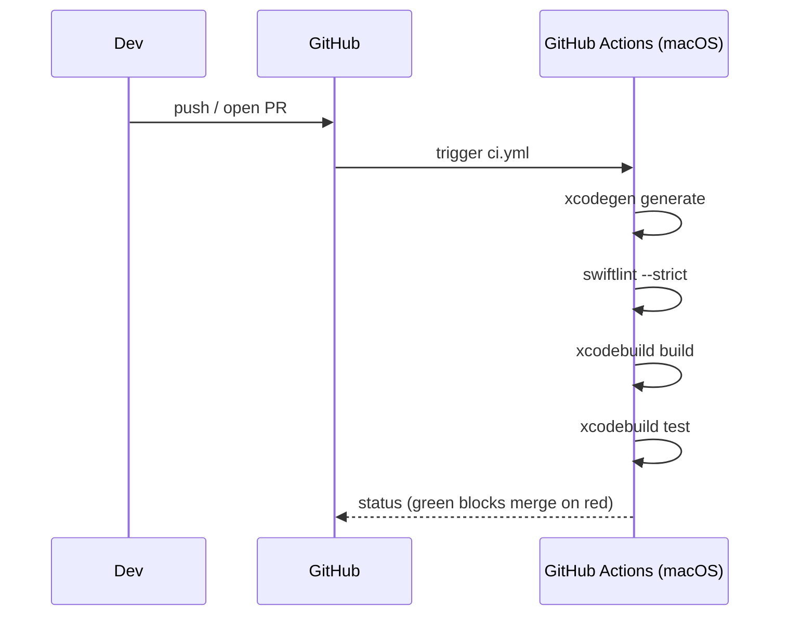

# AYD-004: CI & code-quality gate

> Analysis & Design of an **automated build/test/lint gate**. Today the test suite and the
> convention "keep the linter standardized" (CONV §B.1/§B.2) exist only on paper — nothing
> runs them. This AYD adds tooling only; it changes **no app module** and ships **no product
> behavior**. It is independent of AYD-003/AYD-005 and can land first.

## Goal
Meet **RNF-09**: on every push and pull request, automatically **build** the app, **run the
test suite**, and **lint** the sources; any failure blocks. This turns the existing (untested
by CI) `cal-reminderTests` and the stated linter convention into an enforced gate, catching
regressions before they reach `main`.

## Affected modules
| Module | Role in this feature | Generated SPEC |
|--------|----------------------|----------------|
| CI workflow (new, `.github/workflows/ci.yml`) | macOS runner: resolve project via XcodeGen, `xcodebuild build` + `test`, run the linter; triggered on push + PR | SPEC-007 |
| Linter config (new, `.swiftlint.yml`) | The standardized rule set CONV §B.1 refers to; scoped to `cal-reminder/` and `cal-reminderTests/` | SPEC-007 |
| (source) any current lint violations | One-time fixes so the gate starts green | SPEC-007 |

No `cal-reminder/*.swift` app logic changes — only tooling and mechanical lint fixes.

## Interfaces / contract (source of truth)

**CI pipeline stages (contract with contributors):**
```
on: [push, pull_request]
runner: macos-14           # ships Xcode + Swift toolchain
steps:
  1. install XcodeGen  (brew) and generate cal-reminder.xcodeproj from project.yml
  2. lint:  swiftlint --strict          # warnings fail the build
  3. build: xcodebuild build   -scheme cal-reminder -destination 'platform=macOS'
  4. test:  xcodebuild test    -scheme cal-reminder -destination 'platform=macOS'
gate: a red step blocks the PR
```

**`.swiftlint.yml` shape (starting rule set):**
```
included: [cal-reminder, cal-reminderTests]
opt_in_rules: [empty_count, force_unwrapping, ...]
line_length: { warning: 120, error: 160 }
# tune to the current code so the first run is green (see open questions)
```

## Affected domain model
- None. No glossary term, no entity. Tooling-only.

## Flow


## Key design decisions
- **Generate the `.xcodeproj` in CI from `project.yml`** (XcodeGen) rather than committing a
  generated project, matching how the repo is already structured — avoids a stale checked-in
  project drifting from `project.yml`.
- **Lint is a gate, not advisory** (`--strict`): a warning fails CI, so the "standardized
  linter" convention is actually enforced.
- **No signing in CI.** Build/test only need a generic macOS destination; App Store signing
  (Team, provisioning) belongs to the release pipeline in **AYD-003**, not to the PR gate.

## Out of scope / open questions
- **Out:** release/notarization/upload automation (that pipeline is AYD-003); code-coverage
  thresholds and reporting; auto-formatting on commit; dependency caching tuning.
- **Open — rule strictness:** start from a lenient `.swiftlint.yml` tuned so the current code is
  green, then ratchet rules up in follow-ups (SPEC to pin the initial set).
- **Open — runner image / Xcode version:** pin `macos-14` + an explicit Xcode version so the
  build is reproducible; revisit when the deployment target (macOS 13) or toolchain moves.
