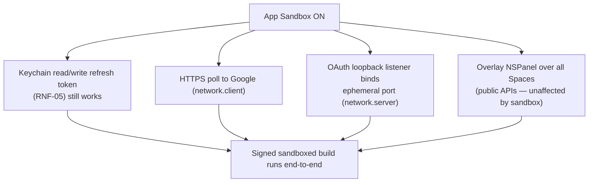

# AYD-005: App Sandbox & privacy compliance artifacts

> Analysis & Design of the **mechanical compliance layer** the Mac App Store requires: the
> App Sandbox entitlements, the privacy manifest, the app icon, and the bundle metadata /
> privacy policy. This is the config-and-artifacts half of App Store readiness; the
> **structural** auth rearchitecture is **AYD-003** (which depends on the entitlements
> defined here). No app *behavior* changes — the airplane, polling and menu stay as-is;
> this AYD adds the wrappers that let a signed, sandboxed build pass App Review.

## Goal
Meet **RNF-08** (and reinforce **RNF-05**): produce and wire the artifacts a MAS build needs —
`*.entitlements` (App Sandbox on), `PrivacyInfo.xcprivacy`, an `AppIcon` set, `Info.plist`
metadata (category, copyright, version), and a public privacy-policy document — and **verify
the sandbox does not break** the three trust-sensitive paths the app already uses: the
Keychain, the OAuth loopback listener, and any Application-Support I/O.

## Affected modules
| Module | Role in this feature | Generated SPEC |
|--------|----------------------|----------------|
| Entitlements (new, `cal-reminder/cal-reminder.entitlements`) | Turn on App Sandbox + the least-privilege capabilities the app needs | SPEC-008 |
| Privacy manifest (new, `cal-reminder/PrivacyInfo.xcprivacy`) | Declare required-reason APIs + collected data types | SPEC-008 |
| Assets / AppIcon (new `AppIcon` set) | Full macOS icon set incl. 1024×1024 (today only the `airplane` imageset exists) | SPEC-008 |
| Info.plist / `project.yml` | `LSApplicationCategoryType`, real copyright, release version; enable Hardened Runtime | SPEC-008 |
| Privacy policy (new, `docs/privacy-policy.md` + hosted URL) | Required by Apple 5.1.1 and Google verification | SPEC-008 |

## Interfaces / contract (source of truth)

**Entitlements (least privilege):**
```
com.apple.security.app-sandbox            = true          // mandatory for MAS
com.apple.security.network.client         = true          // HTTPS to Google Calendar API
com.apple.security.network.server         = true          // OAuth loopback NWListener (AYD-003 / RFC 8252)
// Keychain Services works under sandbox with the app's default access group — no extra key.
// NO files.user-selected / camera / mic / location — the app needs none.
```

**Privacy manifest (`PrivacyInfo.xcprivacy`) — declared contents:**
```
NSPrivacyTracking = false
NSPrivacyCollectedDataTypes:
    - Calendar events  (linked to user, not used for tracking, purpose: app functionality)
    - Email address    (the connected account's email shown in the menu; app functionality)
NSPrivacyAccessedAPITypes:
    - NSPrivacyAccessedAPICategoryUserDefaults   reason: CA92.1   // FlightSpeed/BannerColor/Calendar selection
```

**Bundle metadata:**
```
LSApplicationCategoryType = public.app-category.productivity
NSHumanReadableCopyright  = "© 2026 Silvio Ubaldino"
CFBundleShortVersionString / CFBundleVersion = release values (currently 0.1 / 1)
ENABLE_HARDENED_RUNTIME   = true         // was false in project.yml
```

## Affected domain model
- None. No glossary term. These are packaging/compliance artifacts around the existing model.

## Flow

**Sandbox verification (what SPEC-008 must prove green):**


## Key design decisions
- **Least-privilege entitlements.** Only sandbox + `network.client` + `network.server`. The
  loopback server is the sole reason `network.server` is present; if AYD-003 switches to a
  custom-URL-scheme redirect, this entitlement can be dropped — the two AYDs are coupled here.
- **Application-Support config path goes away under sandbox.** The old `~/Library/Application
  Support/cal-reminder/google-oauth-config.json` (TDR-001) is unreadable in a sandboxed
  container — another reason the credential source must move to the embedded client in AYD-003.
  This AYD assumes AYD-003 has removed that dependency.
- **Privacy manifest is required, not optional.** Apple rejects submissions missing declared
  required-reason API usage; UserDefaults (CA92.1) is the one this app trips.
- **Hardened Runtime on.** Harmless for MAS and required if a notarized non-MAS build is ever cut.

## Out of scope / open questions
- **Out:** the OAuth rearchitecture and signing/Team/provisioning (→ **AYD-003**); CI wiring
  (→ **AYD-004**); localizing the privacy policy; App Store screenshots/marketing copy.
- **Open — icon source:** derive the `AppIcon` from the existing airplane art vs. a new mark;
  needs a 1024×1024 master. SPEC to specify sizes.
- **Open — privacy policy hosting:** GitHub Pages of this repo vs. a separate page; Google
  verification needs a stable public URL under a domain the developer controls.
