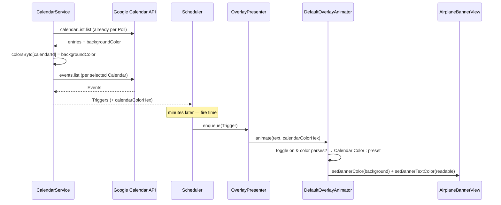

# AYD-006: Banner painted with the Calendar Color

> Analysis & Design of painting each Banner with the **Calendar Color** of the Calendar the
> Event came from (RF-13), instead of always using the single color preset the user picked
> from the menu (RF-08). Extends the reminder flow (AYD-001) and the multi-Calendar Poll
> (AYD-002) — which already fetches every Calendar on each Poll, and is where the color
> comes from. Source of the design — the SPEC implements it.

## Goal
Meet **RF-13**: a user who colors their Calendars in Google (work green, personal blue,
family orange) should recognize *which* Calendar a Reminder came from by the Banner's color
alone. The Banner color preset (RF-08) is kept and becomes the fallback, behind a
"Match calendar color" toggle in the same menu.

Non-goals (kept out on purpose): per-**Event** color (`event.colorId`, which needs a second
`colors.get` call and a palette translation), custom user-defined colors, and coloring the
Airplane or the rope.

## Analysis

The color is already in flight. `calendarList.list` — called on **every** Poll by
`CalendarService` (AYD-002) to resolve the selection — returns each entry's
`backgroundColor` / `foregroundColor` as hex strings (`"#0088aa"`); the app currently
decodes only `id`, `summary`, `primary` and `accessRole`. So no extra request, no extra
scope, no change to the OAuth surface (RNF-08): the feature is a decode + a carry-through.

Two design points worth stating:

1. **The color must ride on the Trigger.** The Banner is painted by the animator, at fire
   time, and a Trigger can fire minutes to hours after the Poll that produced it — the
   Overlay has no Calendar lookup and shouldn't grow one. The Trigger already carries
   everything the Banner needs (title, start, minutes); the Calendar Color joins it. It is
   carried as the **hex string**, not an `NSColor`: `Trigger` is a `Sendable` domain model
   that must not import AppKit.
2. **Text contrast is derived, not fetched.** Google's `foregroundColor` is the color its own
   web UI pairs with the background, but it is not reliably readable at the Banner's size and
   weight. The Banner instead derives its text color from the background's perceived
   luminance (white on dark, near-black on light), which holds for any hex the API returns —
   including colors a future palette change introduces. This keeps RF-05's two-line Banner
   legible on every Calendar.

## Affected modules
| Module | Role in this feature | Generated SPEC |
|--------|----------------------|----------------|
| GoogleCalendarAPI / Models | Decode `backgroundColor` on `calendarList` entries | SPEC-014 |
| CalendarService | Map `calendarId → Calendar Color` from the Poll's `listCalendars()` and stamp it on every Trigger it builds | SPEC-014 |
| Trigger | Carries the Event's Calendar Color (hex) to fire time | SPEC-014 |
| BannerColor (module) | New `MatchCalendarColorStoring` preference + hex→`NSColor` parsing + the readable-text-color rule | SPEC-014 |
| OverlayPresenter / DefaultOverlayAnimator | Resolve the Banner's background + text color per flight: Calendar Color when the toggle is on and one exists, else the preset | SPEC-014 |
| AirplaneBannerView | Accept a Banner **text** color (today hardcoded white) | SPEC-014 |
| MenuBar UI | "Match calendar color" checkbox at the top of the "Banner Color" submenu | SPEC-014 |

No new module and no new integration — `architecture.md` is unchanged.

## Interfaces / contract (source of truth)

**GoogleCalendarListEntry** (addition):
```
backgroundColor: String?     // hex "#0088aa"; optional — never assume the API sends it
```

**Trigger** (addition):
```
calendarColorHex: String?    // the Calendar Color of the Calendar this Trigger came from;
                             // nil when the Calendar has no color (or for the test animation)
```

**OverlayAnimating** (change):
```
animate(text: String, calendarColorHex: String?) async
```

**MatchCalendarColorStoring** (new, alongside `BannerColorStoring`):
```
matchCalendarColor: Bool     // default true — RF-13 is the intended behavior; the toggle turns it off
```

**Color resolution** (the rule the animator applies, per flight):
```
background = matchCalendarColor && parse(calendarColorHex) ?? preset.color
text       = luminance(background) > threshold ? near-black : white
```

## Flow



## Decisions
- **Toggle defaults to on.** RF-13 is the behavior the feature exists to deliver, and it is
  one click to go back to a fixed preset. The preset the user already picked is preserved and
  still applies wherever no Calendar Color exists.
- **Fallback is silent.** A Calendar without a color, an unparseable hex, or the test
  animation (no Calendar behind it) all fall back to the preset — never to a hardcoded color,
  so the user's RF-08 choice always remains the baseline.
- **No `colors.get` call.** `backgroundColor` is returned inline on the list the app already
  makes; resolving `colorId` through the palette endpoint would add a request per Poll for no
  additional coverage.
