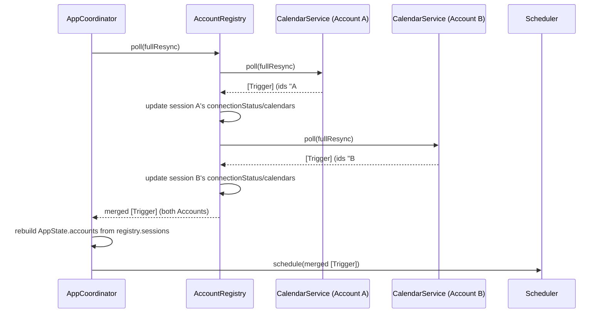
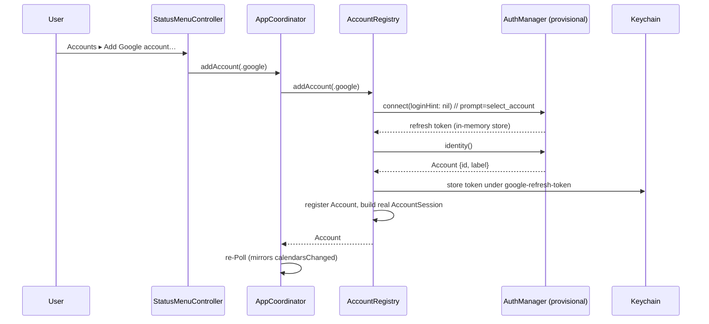

# AYD-007: Multiple Google Accounts

> Analysis & Design of connecting **more than one Google Account at the same time** (RF-14),
> each with its own Calendar selection (RF-10), surfaced from the menu bar as an "Accounts"
> submenu — one submenu per Account, holding that Account's Calendars plus Reconnect/Sign out.
> Source of the design — the SPECs implement it.
>
> **Supersedes AYD-002**: AYD-002 designed Calendar selection for the single connected account
> the app assumed at the time (`AuthManager`/`CalendarService` as app-wide singletons, one
> `selectedCalendarIds` key, dedupe key `calendarId#eventId#minutes`). This AYD keeps AYD-002's
> per-Calendar selection *mechanism* (the checkbox submenu, the `nil` = "all" default, the
> materialize-on-toggle store) but replaces its *scope*: selection, sync state, and Keychain
> storage all move from **one app-wide instance** to **one instance per Account**. AYD-001
> (Overlay/Scheduler/Poll loop) is untouched and stays the current design for those modules —
> only the identity/auth/calendar-fetch layer changes shape.

## Goal
Meet **RF-14** (and the RF-06/RF-10 menu changes it implies): let the user connect N Google
Accounts concurrently, each independently authorized (RF-01), each with its own Calendar
selection persisted across restarts (RF-10), each pollable and revocable independently — one
Account's failure or sign-out never disturbs the others. The Overlay/Scheduler keep firing from
the merged Trigger set exactly as today (RN-02/RN-05 unchanged).

## Affected modules
| Module | Role in this feature | Generated SPEC |
|--------|----------------------|----------------|
| Account (new model) | `{id, provider, label}` — the domain identity of a connected Google Account | SPEC-015 |
| KeychainStore | Scope the stored refresh token by Account (`account:` param instead of a fixed constant) | SPEC-015 |
| AccountStore (new) | Persist the ordered list of connected Accounts (not a secret — UserDefaults, like FlightSpeed/BannerColor) | SPEC-015 |
| CalendarSelectionStore | Unchanged contract; the concrete UserDefaults store is now instantiated per Account, keyed by `accountId` | SPEC-015 |
| AuthManager | Gains `identity()` (resolves `Account` from `userinfo`) and `connect(loginHint:)`; narrows the surface the registry depends on to `AccountAuthenticating` | SPEC-015 |
| AccountRegistry (new) | Owns the set of `AccountSession`s (one `AuthManager` + `CalendarService` pair per Account); fans Poll out across them; handles add/reconnect/sign-out and the legacy single-account migration | SPEC-015 |
| CalendarService | Gains an `accountId`; Trigger dedupe id gains an `accountId#` prefix (RN-03) | SPEC-015 |
| AppState | `connectionStatus`/`calendars` move from one flat value to `[AccountState]`; gains a computed `statusTitle` | SPEC-015 |
| AppCoordinator | Talks to `AccountsManaging` instead of a single `auth`+`calendar` pair; `logout()`/`reconnect()` become per-Account; gains `addAccount()` | SPEC-015 |
| MenuBar / StatusMenuController | Replace the flat "Calendars" item and the single Reconnect/Sign out pair with an "Accounts" submenu — one submenu per Account (Calendars + Reconnect + Sign out inside it) plus "Add Google account…" | SPEC-016 |

## Interfaces / contract (source of truth)

**Account** — the domain identity of a connected Google Account:
```
enum AccountProvider: String, Codable { case google }

Account {
  id: String                // namespaced: "google:<sub>" — Google's own immutable account id
  provider: AccountProvider
  label: String              // the email, shown in the menu (RF-06)
}
```
The `provider` field and the namespaced id exist so a future non-Google Calendar source (out of
scope here, see "Out of scope") never has to migrate stored Account ids to avoid collisions —
see "Open questions".

**AccountAuthenticating** (new, narrow) — the slice of auth the registry depends on; `AuthManaging`
now conforms to it, but a future non-OAuth source would only need to implement this:
```
protocol AccountAuthenticating {
  var isConnected: Bool { get }
  func connect(loginHint: String?) async throws
  func identity() async throws -> Account   // replaces userEmail() -> String
  func disconnect() async
}
```
`AuthManaging` keeps `accessToken()`/`authorizedRequest()` besides this — internal plumbing
between `AuthManager` and `GoogleCalendarAPI`, not part of what the registry needs.

**AccountsManaging** (new — what `AppCoordinator` depends on, replacing `auth`+`calendar`):
```
protocol AccountsManaging: AnyObject {
  var sessions: [AccountSession] { get }   // ordered, mirrors AccountStore; each session's
                                            // connectionStatus/calendars reflect the last
                                            // restore()/verifySessions()/poll() call
  func restore() async                     // load persisted Accounts + legacy migration
  func verifySessions() async              // re-verify each session's connection (startup/reconnect)
  func addAccount(provider: AccountProvider) async throws -> Account
  func reconnect(accountId: String) async throws
  func signOut(accountId: String) async
  func poll(fullResync: Bool) async -> (triggers: [Trigger], anyAccountSucceeded: Bool)
      // fan-out across sessions, merged; updates each session's connectionStatus/calendars
      // in place as a side effect — a session's failure never drops another's Triggers.
      // anyAccountSucceeded distinguishes "no Triggers because there's nothing upcoming"
      // from "no Triggers because every Account failed this round" — the caller needs
      // that to keep a full resync from wiping the Scheduler's armed set on a total
      // outage (RNF-04); see "Key design decisions".
}

AccountSession {
  let account: Account
  var connectionStatus: ConnectionStatus
  var calendars: [CalendarInfo]
}
```
`AppCoordinator` reads `registry.sessions` after `restore()`/`verifySessions()`/`poll()` to
rebuild `AppState.accounts` — it never touches `CalendarServicing`/`AccountAuthenticating`
directly; those stay internal to the registry (one pair per session, not exposed).

**Trigger dedupe key (RN-03 update):** `"<accountId>#<calendarId>#<eventId>#<minutes>"`. Two
Accounts can both hold a Calendar with the same `calendarId` (e.g. a Calendar shared between
them) — without the `accountId` prefix RN-03's dedupe would silently collapse two distinct
Triggers into one.

**AppState** (replaces the single `connectionStatus`/`calendars` fields):
```
AccountState {
  id: String; label: String
  connectionStatus: ConnectionStatus       // unchanged enum (disconnected/connecting/connected/needsReauth)
  calendars: [CalendarInfo]
}
AppState {
  accounts: [AccountState]
  enabled: Bool
  nextTrigger: Trigger?
  refreshing: Bool
  statusTitle: String   // computed: "Not connected" / "Connecting…" / "Connected as x@y"
                         // (1 Account) / "Connected · N accounts" / "N accounts · 1 needs reconnect"
}
```

## Affected domain model
- **Account** *(new glossary term)* — `{id, provider, label}`; the id is namespaced per provider
  so it stays globally unique even if a future source is added.
- **Calendar** — unchanged shape, now scoped under an Account rather than "the" account.
- **Calendar Selection** — unchanged shape (`Set<String>?`, `nil` = all), now one instance
  **per Account** (`selectedCalendarIds.<accountId>` instead of the single `selectedCalendarIds`).
- **Trigger** — unchanged shape; only its dedupe `id` gains the `accountId#` prefix (RN-03).
- **Keychain storage** — one refresh token per Account, keyed `google-refresh-token#<accountId>`
  (was a single fixed key).

## Flow

**Poll (fan-out across Accounts → merged Triggers):**


**Add a second Account (menu → registry → Keychain):**


**Legacy single-account migration (first launch after upgrade):**
```mermaid
sequenceDiagram
    participant Reg as AccountRegistry
    participant Store as AccountStore
    participant KC as Keychain (legacy key)
    participant Auth as AuthManager (legacy token)

    Reg->>Store: accounts
    Store-->>Reg: [] (empty)
    Reg->>KC: refreshToken() under legacy "google-refresh-token"
    KC-->>Reg: token (present)
    Reg->>Auth: identity() using the legacy token
    alt resolves
        Auth-->>Reg: Account {id, label}
        Reg->>KC: re-key token under google-refresh-token#<id>; delete legacy key
        Reg->>Store: copy selectedCalendarIds → selectedCalendarIds.<id>; register Account
    else refreshTokenRevoked
        Reg->>KC: delete legacy key (dead token) — no Account registered
    else network error
        Reg->>Reg: leave legacy key untouched — retry next launch
    end
```

## Key design decisions
- **`AccountRegistry` replaces the single `auth`/`calendar` pair the `AppCoordinator` held** —
  minimal blast radius on `Scheduler`/`OverlayPresenter`/`PollLoop`, which stay account-agnostic
  (they only ever see `Trigger`s).
- **The `accountId` prefix in `Trigger.id`, not a separate field** — same pattern AYD-002 used for
  `calendarId`, keeps RN-03's dedupe correct without touching `Scheduler`'s dedupe logic.
- **Google's `sub`, not the email, is the stored identity** — an email address is mutable (Google
  Workspace rename, alias); `sub` is not. The email is kept only as the display `label`.
- **`provider` + a namespaced id now, not later** — the two fields that would force re-keying
  every stored Account, Keychain entry, and `selectedCalendarIds` entry if added after the fact.
  See "Open questions" — no non-Google source is implemented here.
- **Legacy migration is silent and additive** — a valid stored token is never destroyed on a
  network hiccup; only a token Google itself rejects (`refreshTokenRevoked`) is cleared.
- **One Account's Poll failure doesn't touch the others** — `AccountRegistry.poll()` isolates
  errors per session, mirroring how `CalendarService.poll()` already isolates errors per Calendar
  (AYD-002). A single Account failing during a full resync (RF-12) does lose *that* Account's
  Triggers until its next successful Poll — an accepted trade-off, since it's the exact same
  behavior a single failed Calendar within one Account already has today.
- **`poll()` also reports whether *any* Account succeeded** — a full resync must not wipe the
  Scheduler's armed set on a *total* outage (every Account failing at once, e.g. no network at
  all) the way the previous, single-account build never called `cancelAll()` when its one Poll
  call threw. Losing one Account's Triggers on a partial failure (above) is accepted; losing
  *everyone's* Triggers because the whole request round happened to fail is not — `[Trigger]`
  alone can't tell "nothing upcoming" apart from "everything failed", so `poll()` returns
  `anyAccountSucceeded` alongside the merged Triggers for `AppCoordinator` to gate `cancelAll()` on.

## Out of scope / open questions
- **Out:** non-Google Calendar sources (e.g. iCloud/EventKit); per-Account Flight Speed/Banner
  color; account-level rate limiting or backoff tuning; renaming `AuthError.refreshTokenRevoked`
  to a provider-neutral name (pure rename, no data migration — deferred as low-value churn now).
- **Open — future non-Google sources:** on macOS the natural path for iCloud/Exchange/local
  calendars is **EventKit** (`EKEventStore`), not CalDAV — it already reads whatever is configured
  in Calendar.app, and `EKAlarm.relativeOffset` maps directly to Reminder minutes. Such a source
  has no OAuth credential and not necessarily an email, which is exactly what
  `AccountAuthenticating`'s narrow surface (vs. the wider `AuthManaging`) is shaped to
  accommodate — but wiring it in also needs the `com.apple.security.personal-information.calendars`
  entitlement and a `NSCalendarsFullAccessUsageDescription` string, neither present today. Left
  for a future AYD; this one only guarantees the id/model won't need re-keying when it lands.
- **Open — Account ordering:** Accounts render in `AccountStore` insertion order (first connected,
  first shown); no manual reordering. Revisit if users ask for it.
