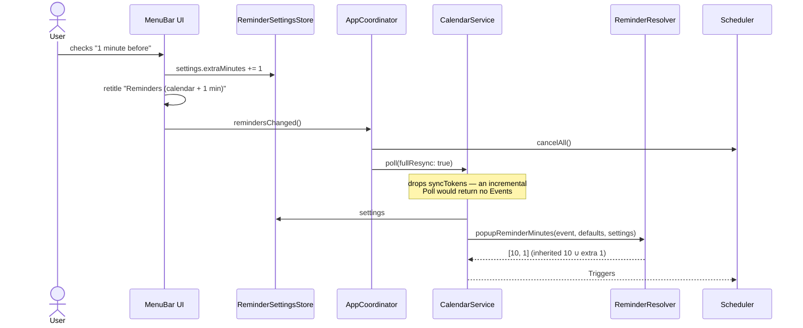

# AYD-008: Choosing which Reminders fire

> Analysis & Design of **RF-15**: letting the user decide, from the menu bar, which Reminders
> actually fly — the Event's own ones (as Google resolves them today) plus any number of
> **Extra Reminders** the app adds to every Event. Extends AYD-001's reminder resolution; it
> does not replace it. Source of the design — SPEC-017 implements it.

## Goal
Today the app is a passive mirror of Google Calendar: an Event flies exactly at the Reminders
it carries (RN-04), or at 5 minutes when it carries none (RN-06). That is right as a default
and wrong as a ceiling. The recurring want is *"whatever the calendar says, also warn me right
before it starts"* — the 10-minute popup is when you decide to go; the 1-minute Overlay is what
actually gets you there. RF-15 gives the user that second alert without touching a single Event
in Google, and without making them re-teach the app what their calendar already knows.

Non-goals, on purpose: per-Calendar or per-Account Reminder sets (§Decisions), arbitrary
minute entry, per-Event overrides from the app (the app is read-only, RF-01), and snooze.

## Analysis

### The shape of the setting: a set, not a flag plus a value
The obvious first design is a checkbox ("add an early alert") plus a value picker (1/5/10/15).
It looks smaller, and it is worse:

- It encodes **two** concepts (is it on? how early?) for **one** user intent (which alerts do
  I want), and the value control is dead weight whenever the flag is off.
- It caps the user at exactly one Extra Reminder. "1 minute *and* 5 minutes" is a normal want
  — one to stand up, one to arrive — and the flag design has no room for it.
- It leaves the interesting state unreachable: *only* my own fixed alerts, ignoring what the
  calendar carries. Someone whose work calendar is full of inherited 30-minute popups wants
  precisely that.

Modeling the whole thing as **one set of checkboxes** collapses those into a single question
with a single answer shape:

```
Reminders = (Event's own reminders? ∪ Extra Reminders)
```

Every state the flag design can express is still reachable, and three more are too. The cost is
one extra concept in the menu — the "Event's own reminders" row — which is exactly the concept
the user already has in their head.

### Union, not concatenation
Two branches can name the same minute (an Event with a 5-minute popup, while "5 minutes before"
is checked). The resolver dedupes by minutes, so that Event flies **once** at 5 minutes. Doing
this at resolution time rather than leaning on RN-03's dedupe key keeps the Trigger list, the
"Next:" menu row and the Overlay queue (RN-05) honest about how many flights are actually coming.

### The fallback belongs to the inherited branch
RN-06's 5-minute fallback exists so an Event with no popup at all still gets announced. Once
Extra Reminders exist, there are two defensible rules: keep the fallback independent, or
suppress it when an Extra Reminder already guarantees the Event is announced.

The design keeps it **independent**: with "Event's own reminders" on, an Event carrying nothing
resolves to `[5]` — plus whatever extras are checked — so an Event with no popups behaves like
one with a 5-minute popup, always, whatever else the user checked. The alternative makes a
checkbox's meaning depend on the state of the *other* checkboxes, which is exactly the coupling
this design removed from the flag-plus-value shape. When the user does not want the fallback,
the honest control is the one already on screen: turn "Event's own reminders" off.

### The empty state is legal, and must be visible
Unchecking everything is a reachable state that silently makes the app do nothing — the worst
failure mode for a menu bar agent, because there is no screen to look at and no error to read.
Two ways out were considered: refuse the last uncheck (a click that does nothing reads as a
bug), or allow it and *say so*. The design allows it and makes it loud in the only place the
user can look: the submenu carries a warning row, and — the part that matters — the parent
menu item states the current selection inline, so the state is legible **without opening the
submenu at all**:

```
Reminders (calendar + 1, 5 min)
Reminders (10 min)
Reminders (none)              ← the empty state, visible at a glance
```

"Pause" (RF-06) remains the control for *temporarily* silencing the app; an empty Reminder set
is a configuration, not a pause, and the two must not be confused.

### Changing the set must rebuild Triggers now, and needs a full resync
Flight Speed (RF-07) and Banner color (RF-08) apply "from the next animation on" because they
only affect how a flight looks. This setting changes **which Triggers exist**, so it must take
effect immediately — a user who checks "1 minute before" and then watches a meeting start
without a flight has learned the setting is broken.

That rebuild cannot be an incremental Poll. `CalendarService` keeps a `syncToken` per Calendar
(RNF-06), so an incremental Poll after cancelling the armed Triggers returns only *changed*
Events — i.e. almost nothing — and the upcoming Triggers would be silently lost until the next
Event edit. The Reminder-selection change therefore drops the sync tokens and refetches the
window, exactly like the manual "Refresh now" full resync (RF-12, SPEC-013).

### "At start time" (0 minutes)
The preset list includes 0. It is the single most-wanted extra alert ("the meeting is starting
*now*"), it costs nothing structurally — `Event start − 0` is a valid Trigger and the Scheduler
already drops past-due ones — but it does break the Banner's copy: `at 14:00 (in 0 min)` reads
like a bug. The Banner formatter gains one case, `at 14:00 (starting now)`, which is also the
right text for the RF-05 two-line layout.

## Affected modules
| Module | Role in this feature | Generated SPEC |
|--------|----------------------|----------------|
| ReminderSettings (new) | The domain value: inherit flag + chosen Extra Reminder minutes, the preset list, their labels, and the menu summary string | SPEC-017 |
| ReminderSettingsStore (new) | Persists the selection app-wide across restarts (`UserDefaults` boundary, faked in tests) | SPEC-017 |
| ReminderResolver | Applies RN-07: union of the inherited branch (unchanged RN-04/RN-06) and the Extra Reminders | SPEC-017 |
| CalendarService | Reads the current settings on each Poll and passes them to the resolver | SPEC-017 |
| MenuBar UI | New "Reminders" submenu; parent title states the current selection; warning row on the empty state | SPEC-017 |
| AppCoordinator | `remindersChanged()` — cancel armed Triggers and re-Poll as a **full resync** | SPEC-017 |
| BannerText | `minutesBefore == 0` reads "starting now" | SPEC-017 |

No new module and no new integration; `architecture.md` gains only the menu entry in the
MenuBar UI row.

## Interfaces / contract (source of truth)

**ReminderSettings** (new value type):
```
inheritEventReminders: Bool     // default true — today's behavior
extraMinutes: Set<Int>          // default [] — today's behavior
static presetMinutes: [Int] = [0, 1, 5, 10, 15]
static label(forMinutes:) -> String   // 0 → "At start time"; 1 → "1 minute before"; n → "n minutes before"
var isSilent: Bool              // !inheritEventReminders && extraMinutes.isEmpty
var summary: String             // "calendar + 1, 5 min" | "10 min" | "calendar" | "none"
```

**ReminderSettingsStoring** (new, alongside `SkipOnClickStoring`):
```
settings: ReminderSettings { get set }   // defaults above; nothing stored → today's behavior
```

**ReminderResolver** (change — the resolution rule, RN-07):
```
popupReminderMinutes(for:calendarDefaults:settings:) -> [Int]
  inherited = settings.inheritEventReminders ? <RN-04 result, or [5] when empty (RN-06)> : []
  return inherited + settings.extraMinutes.subtracting(inherited).sorted()
```
The inherited part keeps its API order, and `settings == .default` returns exactly what the
current implementation returns — the feature is invisible until the user opens the menu.

**BannerText** (change):
```
minutesBefore == 0  →  "<Title>\nat HH:MM (starting now)"
```

## Flow



## Decisions
- **App-wide, not per Calendar or per Account.** "Warn me 1 minute before" is a statement about
  the user, not about a calendar; per-Calendar sets would multiply an already two-level menu
  (Accounts ▸ Account ▸ Calendars) by a third axis. Forward-compatible: a future per-Calendar
  override can live inside the existing Calendars submenu with this setting as its default.
- **Fixed presets, no free-form minutes.** A text field in an `NSMenu` needs a custom view, a
  validation story and an error state, for a long tail (7 minutes?) that no one has asked for.
  0/1/5/10/15 covers the intent; extending the list later is one array entry.
- **Defaults preserve today's behavior exactly** — inherit on, no extras. Existing installs see
  no change and need no migration; the feature is opt-in from the menu.
- **The selection is stated in the parent menu item.** The single highest-value affordance here:
  a menu bar setting that changes *whether the app does anything* must be readable without
  drilling in.
- **The empty set is allowed.** It is a legitimate (if odd) configuration, it is labelled
  "none" in the parent item and warned about in the submenu, and refusing the last uncheck
  would read as a broken menu.
