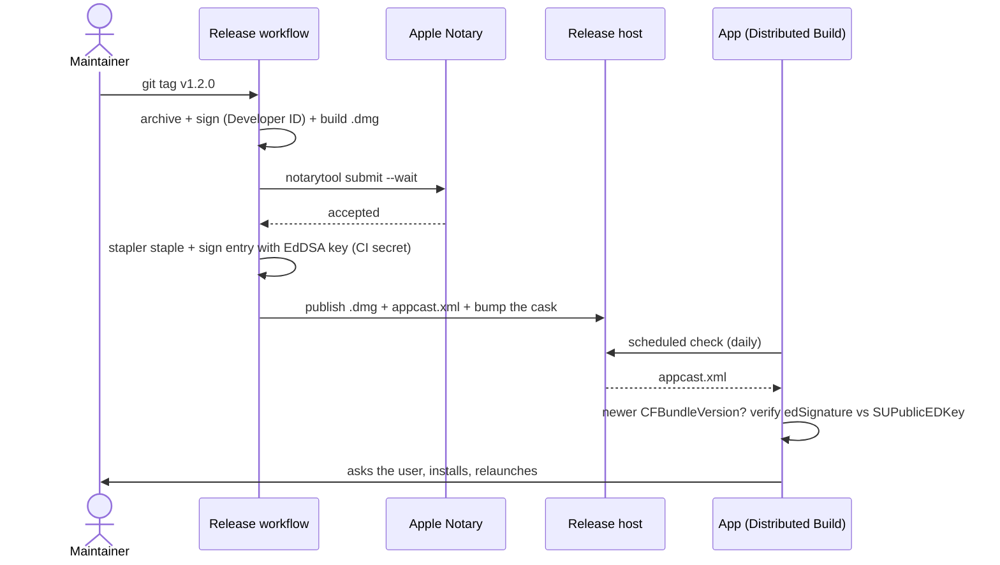

# AYD-009: Direct distribution & auto-update

> Analysis & Design of how the app **reaches a user and stays current**: signed and notarized
> outside the Mac App Store, delivered as a `.dmg` and a Homebrew Cask, updating itself from a
> signed Appcast (RF-16). **Supersedes AYD-003**, whose Mac App Store target is withdrawn.
> The signing configuration and the compliance artifacts that survive the move are **AYD-010**;
> the CI gate is **AYD-004**. Source of the design — the SPECs implement it.

## Goal
Meet **RF-16**, **RNF-07**, **RNF-11** and **RNF-12**: a user downloads a `.dmg` (or runs
`brew install --cask`), drags the app across, signs in, and never thinks about versions again —
while a developer can clone the repository, register their own Google OAuth client, and build the
same app for free. One codebase, two artifacts, no feature gate between them.

Non-goals: license keys, trial timers, activation servers, telemetry, or any check that a copy was
paid for (§Decisions — this is what "sold on trust" means). The token broker (RNF-10's target) is
also out; this AYD only removes the client secret from the *repository* (TDR-007).

## Analysis

### Why the App Store is withdrawn, not postponed
AYD-003 targeted the Mac App Store. RF-16 makes that target self-contradictory: **a sandboxed store
app is forbidden from updating itself** — updates are the store's job, and bundling an updater is a
rejection reason. So the choice is not "store now, updater later"; it is one or the other.

| | Direct (Developer ID + Appcast) | Mac App Store |
|---|---|---|
| RF-16 (self-update) | Yes, project-controlled | Impossible — the store owns it |
| Time to ship a fix | Minutes | Days of App Review |
| Revenue share | None | 15–30% |
| App Sandbox | The project's choice (AYD-010) | Mandatory |
| Demo account for review | Not needed | Required, and awkward for RNF-08's restricted scope |
| Discovery | Must be earned (landing page, word of mouth) | Store search |

Direct distribution wins every row that this project cares about, and loses the one it does not:
store discovery is worth little for an app sold on trust to people who were told about it. Dropping
the store also deletes two obligations outright — App Review and the demo Google account AYD-003
built its whole OAuth rearchitecture around.

What the store's absence does **not** fix: Gatekeeper still needs the app signed with a Developer ID
certificate and **notarized**, or a first launch shows "cannot be opened because the developer cannot
be verified" — worse than a store listing, because the user has already paid. Notarization is the
floor for RNF-07, not an optimization (AYD-010).

### The update mechanism is a security boundary, not a feature
RF-16 hands a background agent the ability to download code and run it. Whoever can write the
Appcast, or intercept its download, owns every user's machine. HTTPS alone is not enough: it only
proves the bytes came from the host, and the host is a static file server the project does not
operate (GitHub). So the integrity requirement (**RNF-11**) is signature-based and independent of
transport — the app carries a public key and refuses anything it cannot verify against it.

This rules out the tempting shortcuts: "download the `.dmg` and open it", a `curl | sh` updater, or
trusting a GitHub Release's checksum file (which lives next to the artifact it certifies, so anyone
who can replace one can replace the other). **Sparkle 2 with an EdDSA-signed Appcast** is the
mechanism (TDR-006): the signature is made by a key held offline from the download host, and the
verification happens before a single byte is executed.

### The Source Build must not be a lesser app
RNF-12's promise is that the repository builds the *same* app. That has one structural consequence
worth stating before the module table: **nothing about the paid path may be enforced in the app**.
No license check, no gated feature, no "unregistered" nag. Which means the only things that can
distinguish the two builds are things the project cannot hand out anyway:

| | Source Build | Distributed Build |
|---|---|---|
| Features | All | All |
| Google OAuth client | The builder's own (TDR-007) | The project's, injected at build time |
| Signature | The builder's, or none | Developer ID + notarized |
| Auto-update | Never (no key, no feed) | Yes (RF-16) |

The auto-update asymmetry is a consequence, not a policy: a Source Build has no legitimate Appcast
to trust — pointing it at the project's feed would make it silently replace the user's own build
with the project's signed one, changing which OAuth client their tokens belong to. So `SUFeedURL`
and `SUPublicEDKey` are absent from a Source Build, and the updater disables itself when either is
missing (§Interfaces). The menu says so plainly rather than hiding the item.

### The secret in the repository is a today problem
`GoogleOAuthConfig.swift` currently carries a live `client_secret` in tracked source (TDR-003, which
assumed a private, personal repository). RNF-12 makes the repository public, which publishes it —
and GitHub's secret scanning will report it to Google, which may revoke it without warning. This
AYD therefore carries a **prerequisite slice**: rotate the credential and move it to build-time
injection (TDR-007) before the repository is published. It is sequenced first among the SPECs for
that reason.

### Landing page **and** Homebrew, not either
The two reach disjoint audiences and cost different amounts.

- The **landing page is mandatory regardless**: it is where a non-technical user downloads and pays,
  and RNF-08 independently requires a public privacy-policy URL on a domain the project controls for
  Google's restricted-scope verification. Its cost is already sunk into another requirement.
- A **Homebrew Cask** is a single `.rb` file in a tap the project owns, updated by the same release
  job that publishes the `.dmg`. For the developer audience — the same people most likely to read the
  source and then pay for convenience — `brew install --cask` is the lowest-friction install there is.
- `npm install` is **rejected**: a Node package manager is the wrong delivery vehicle for a native
  `.app`, and the audience that has Node is a subset of the audience that has Homebrew.

The two channels must not fight over who updates the app. Homebrew's `auto_updates true` stanza is
exactly that declaration: `brew upgrade` leaves the app alone and Sparkle keeps it current, so a
cask-installed copy behaves like a downloaded one.

## Affected modules
| Module | Role in this feature | Generated SPEC |
|--------|----------------------|----------------|
| GoogleOAuthConfig | Stop carrying the credential in tracked source; read it from a build-time configuration, absent in a Source Build until the builder supplies one (TDR-007) | SPEC-018 |
| Release pipeline (new, `.github/workflows/release.yml`) | On a `v*` tag: archive → sign (Developer ID) → `.dmg` → notarize → staple → sign the Appcast entry → publish the Release, the Appcast and the cask | SPEC-019 |
| Versioning (`project.yml`) | `CFBundleShortVersionString` and a monotonic `CFBundleVersion` derived from the tag instead of the hardcoded `0.1` / `1` | SPEC-019 |
| UpdateController (new) | Owns the Sparkle updater: automatic checks, on-demand check, "no feed configured" state | SPEC-020 |
| MenuBar UI | Version row, "Check for updates…", "Check automatically" toggle, and the Source-Build explanation | SPEC-020 |
| Landing page (new) | Download, purchase, privacy policy, install instructions; the domain Google verification points at | SPEC-021 |
| Homebrew Cask (new, own tap) | `brew install --cask`, `auto_updates true`; version and checksum bumped by the release job | SPEC-021 |

New integration: the **Release host** (Appcast + `.dmg`) — `architecture.md` gains it in the same
edit, along with the `UpdateController` component.

## Interfaces / contract (source of truth)

**Update configuration** (`Info.plist`, present only in a Distributed Build):
```
SUFeedURL              = https://<project domain>/appcast.xml   // HTTPS, no exceptions
SUPublicEDKey          = <base64 ed25519 public key>            // the RNF-11 trust anchor
SUEnableAutomaticChecks = <unset>   // Sparkle asks the user on first launch; no silent opt-in
SUScheduledCheckInterval = 86400
```

**UpdateController** (new):
```
protocol Updating {
    var isConfigured: Bool { get }          // false when SUFeedURL or SUPublicEDKey is absent
    var automaticallyChecks: Bool { get set }
    var currentVersion: String { get }      // CFBundleShortVersionString
    func checkForUpdates()                  // user-initiated; shows Sparkle's UI
}
```
Contract: when `isConfigured` is false the controller performs **no** network activity, and the
menu states "Updates: source build" instead of offering a check. The updater never activates the
app or steals focus outside a user-initiated check (RNF-02's spirit applies to it too).

**Appcast entry** (produced by the release job, one per Release):
```xml
<item>
  <title>1.2.0</title>
  <sparkle:version>42</sparkle:version>                 <!-- CFBundleVersion, monotonic -->
  <sparkle:shortVersionString>1.2.0</sparkle:shortVersionString>
  <sparkle:minimumSystemVersion>13.0</sparkle:minimumSystemVersion>
  <description><![CDATA[ <!-- the changelog entries for this Release --> ]]></description>
  <enclosure url="https://…/cal-reminder-1.2.0.dmg"
             sparkle:edSignature="<ed25519 signature>" length="…"/>
</item>
```

**Release invariants** (the pipeline is not done unless all hold):
```
codesign --verify --deep --strict           → valid on-disk signature
spctl --assess --type execute               → accepted (notarization stapled)
CFBundleVersion strictly greater than the previous Release's
edSignature verifies against SUPublicEDKey
the signing key never appears in the repository or in build logs   (RNF-11)
```

## Affected domain model
Four glossary terms, already added to GLO: **Release**, **Appcast**, **Distributed Build**,
**Source Build**. No change to Account / Calendar / Event / Reminder / Trigger — updating the app is
orthogonal to what it does.

## Flow

**Release (tag → users):**


**Source Build:** clone → register a Google OAuth client → drop the credential into the untracked
build configuration (TDR-007) → build. No `SUFeedURL`, no `SUPublicEDKey`, so `Updating.isConfigured`
is false and the update path is inert.

## Decisions
- **The Mac App Store is out, permanently.** It cannot coexist with RF-16, and its costs (review
  latency, revenue share, mandatory sandbox as a distribution term) buy discovery this product does
  not depend on. AYD-003 is superseded, not paused.
- **Signature-verified updates, transport-independent (RNF-11).** The trust anchor is the public key
  compiled into the app, not the host serving the file. Control of GitHub Releases, of the domain,
  or of the network is individually insufficient to ship code to a user.
- **No enforcement of the purchase, anywhere in the app.** No license key, no activation call, no
  gated feature, no nag. RNF-12 is a promise about the artifact, and an app that checks whether it
  was paid for has broken it. The commercial mechanism is the landing page; the app never knows.
- **A Source Build never self-updates**, because it has no feed it can safely trust — not as a
  penalty. The menu says so instead of hiding the control, so the difference is legible rather than
  mysterious.
- **Both channels ship, landing page first.** The page is required by RNF-08 anyway; the cask is one
  file the same job maintains. `auto_updates true` keeps Homebrew from racing Sparkle.
- **Rotate the committed secret before publishing the repository.** Sequenced as the first SPEC
  because publication is what makes the existing disclosure real (TDR-007).
- **Own tap before `homebrew-cask`.** The official cask repository applies notability rules a new
  project will not meet; `silvioubaldino/tap` works on day one and the canonical name can be claimed
  later without breaking installs.

## Out of scope / open questions
- **Token broker (RNF-10's target).** Still the direction; this AYD only gets the secret out of the
  repository. Auto-update is what will make that migration deployable without a reinstall.
- **Delta updates.** Sparkle supports them; not worth the pipeline complexity at this size.
- **The payment mechanism itself** (which processor, licence wording, refunds) — a product decision
  for SPEC-021, constrained only by "the app must not know about it".
- **Open:** the domain name, and whether the landing page is hosted on GitHub Pages or elsewhere.
  Neither changes any contract above — `SUFeedURL` is the only coupling, and it is one string.
- **Open:** whether a Source Build should be able to point at its *own* Appcast. Cheap to allow
  later (both keys are already read from `Info.plist`); deliberately unaddressed now.
