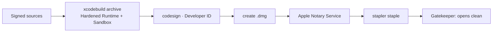

# AYD-010: Signing, sandbox & compliance outside the App Store

> Analysis & Design of the trust artifacts a **directly distributed** build needs: Developer ID
> signing, notarization, the entitlements it actually runs under, and which of AYD-005's compliance
> artifacts survive the loss of App Review. **Supersedes AYD-005**, whose premise — "the mechanical
> compliance layer the Mac App Store requires" — no longer holds (AYD-009). The delivery pipeline
> that consumes this configuration is AYD-009. No app behavior changes.

## Goal
Meet **RNF-07**'s signing half and **RNF-08**: a user who downloads the `.dmg` on a machine that has
never seen this project opens it with a normal double-click — no Gatekeeper warning, no
right-click-to-open — and Google's restricted-scope review can find a real privacy policy on a real
domain. Reinforces **RNF-05** by keeping the app's runtime privileges minimal.

## Analysis

### What actually changed when the store went away
AYD-005 shipped a set of artifacts because a submission form demanded each of them. Without the
store, each one has to re-justify itself against a different question: *does it still protect the
user or unblock a real gate?*

| Artifact (AYD-005) | Why it existed | Verdict now |
|---|---|---|
| Developer ID signing | Store signing | **Required** — Gatekeeper, and the prerequisite for notarization |
| Notarization + staple | (not in AYD-005 — the store did it) | **Required, and new** |
| Hardened Runtime | Store requirement | **Required** — notarization refuses a build without it |
| App Sandbox | Mandatory for MAS | **Kept by choice** (§below) |
| `PrivacyInfo.xcprivacy` | App Store submission | **Kept, no longer a gate** — cheap, already written, and honest documentation |
| AppIcon set | Store listing | **Required** — a `.dmg` and the menu bar still need one |
| Privacy policy + hosted URL | Apple 5.1.1 + Google | **Required** — Google's restricted-scope verification is unchanged by the store's absence |
| Demo Google account for review | App Review | **Deleted** — nobody reviews this build |
| App Store Connect metadata, screenshots, category | Store listing | **Deleted** (`LSApplicationCategoryType` stays; it is harmless and correct) |

Two things get *harder* without the store, and both are notarization's doing: the build must carry a
Hardened Runtime with no `get-task-allow`, and every release has to make a round trip through
Apple's notary service before it can be handed to anyone (AYD-009's pipeline owns that latency).

### Keeping the sandbox is a choice, and it costs something
Outside the store nobody enforces `com.apple.security.app-sandbox`. The honest framing is a
trade-off rather than a compliance box:

- **For keeping it.** It is already on and working — the app needs exactly `network.client`
  (Google's API) and `network.server` (the RFC 8252 loopback listener) and nothing else. A calendar
  agent that provably cannot touch the filesystem, camera, microphone or location is a claim worth
  being able to make to someone deciding whether to trust a `.dmg` from an individual developer, and
  it directly reinforces RNF-05. It also keeps the store reachable if that judgement ever changes.
- **Against keeping it.** Sparkle's installer must then run out of process: the app has to embed
  Sparkle's XPC services and declare two `temporary-exception.mach-lookup.global-name` entitlements.
  That is real complexity in exactly the component that must never be flaky (RNF-11).

**Decision: keep the sandbox**, and pay Sparkle's XPC cost once in the pipeline. The escape hatch is
written down deliberately: if the sandboxed installer proves unreliable in practice, dropping the
sandbox is *acceptable* for a Developer ID build — Hardened Runtime plus notarization remain the
Gatekeeper bar — and that reversal is a **new TDR**, not a silent edit here.

### Signing identity and where the keys live
Three secrets now gate a release, and none may enter the repository (RNF-11's rule generalizes):
the Developer ID certificate and its private key, an app-specific password (or App Store Connect API
key) for `notarytool`, and the EdDSA Appcast key (TDR-006). In CI they are encrypted secrets
imported into a temporary keychain that is destroyed with the runner; locally they live in the
maintainer's login keychain. `DEVELOPMENT_TEAM`, empty in `project.yml` today, becomes the real Team
ID — it is not a secret and is committed.

## Affected modules
| Module | Role in this feature | Generated SPEC |
|--------|----------------------|----------------|
| `cal-reminder.entitlements` | Keep App Sandbox + `network.client` + `network.server`; add the two Sparkle XPC `mach-lookup` exceptions; still no file, camera, mic or location access | SPEC-019 |
| `project.yml` | Real `DEVELOPMENT_TEAM`, Developer ID signing configuration, Hardened Runtime (already on), `LSApplicationCategoryType` (kept) | SPEC-019 |
| `PrivacyInfo.xcprivacy` | Kept as-is; re-checked against what the app actually collects | SPEC-019 |
| `AppIcon.appiconset` | Unchanged — still needed for the app, the `.dmg` and the landing page | — |
| `docs/privacy-policy.md` | Unchanged in substance; gains its public URL from the landing page (AYD-009 / SPEC-021) | — |

No module is added and no integration changes; `architecture.md` is untouched by this AYD.

## Interfaces / contract (source of truth)

**Entitlements (least privilege, direct distribution):**
```
com.apple.security.app-sandbox                                    = true   // kept by choice
com.apple.security.network.client                                 = true   // HTTPS to Google
com.apple.security.network.server                                 = true   // OAuth loopback (RFC 8252)
com.apple.security.temporary-exception.mach-lookup.global-name    = [ $(PRODUCT_BUNDLE_IDENTIFIER)-spks,
                                                                      $(PRODUCT_BUNDLE_IDENTIFIER)-spki ]
// Sparkle's sandboxed status + installer XPC services. Nothing else:
// no files.user-selected, no camera, mic, location, or Apple Events.
// Keychain Services works under the sandbox with the app's default access group.
```

**Signing configuration:**
```
CODE_SIGN_IDENTITY   = "Developer ID Application"
DEVELOPMENT_TEAM     = <real Team ID>          // committed; not a secret
ENABLE_HARDENED_RUNTIME = YES                  // notarization refuses NO
// No com.apple.security.get-task-allow in a Release build.
```

**Acceptance (the same checks AYD-009's pipeline enforces per Release):**
```
codesign --verify --deep --strict --verbose=2 cal-reminder.app   → valid
spctl --assess --type execute cal-reminder.app                   → accepted
xcrun stapler validate cal-reminder.dmg                          → validated
// and, on a machine that has never run this app: double-click opens it, no warning.
```

## Affected domain model
None. This AYD adds no glossary term and touches no entity — it configures how the same binary is
signed and what it is allowed to do.

## Flow


## Decisions
- **Notarization is a hard gate, not a nicety.** An un-notarized `.dmg` shows "the developer cannot
  be verified" on first launch — for a paying user that reads as a scam, which is a worse first
  impression than any store listing this project gave up.
- **The App Sandbox is kept**, though nothing outside the store enforces it: the app needs only two
  network entitlements, so the privilege claim is nearly free and reinforces RNF-05. Reversing it
  requires a new TDR.
- **`PrivacyInfo.xcprivacy` is kept without being required.** It costs nothing, it is already
  accurate, and it keeps the store door reachable.
- **The demo-account requirement dies with App Review.** AYD-003's entire OAuth rearchitecture was
  driven by it; only the parts that serve real users survive into AYD-009.
- **Signing secrets never enter the repository**, in any encoded form. CI imports them into a
  throwaway keychain (AYD-009's pipeline).

## Out of scope / open questions
- The release pipeline that runs these steps, and everything about the Appcast — **AYD-009**.
- Google's restricted-scope verification submission itself (a process, not a build artifact); this
  AYD only guarantees the privacy policy and its host domain exist.
- **Open:** whether to notarize with an App Store Connect API key or an app-specific password. Both
  satisfy the contract; the pipeline SPEC picks one.
