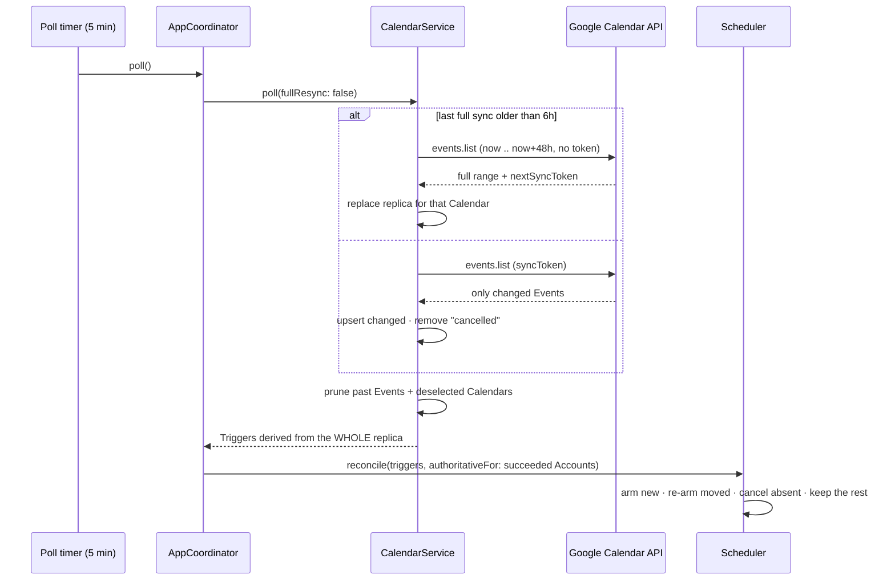

# AYD-011: Event replica and Trigger lifecycle

> Analysis & Design of a **correctness** change, not a feature: making the app fire every
> Reminder it is supposed to fire (RF-04, RN-02) while keeping the incremental sync RNF-06
> asks for. It **overrides AYD-001's Poll → Scheduler contract** — the shape of what a Poll
> returns and what the Scheduler does with it — and the 2-hour Poll window decided there.
> AYD-001 stays the source for everything else it designed (Overlay, OAuth, Flight Speed).
> Source of the design — SPEC-021 implements it.

## Goal
The app currently drops Reminders silently, in three distinct ways, all of them invisible to
the user: there is no error, no log they read, and no screen to check — the airplane simply
never flies. This design makes the Poll's output **authoritative** and the armed Trigger set a
**reconciliation** of it, which closes all three at once and honors RNF-04's promise ("re-syncs
on wake; keeps scheduled Triggers") that the code does not currently keep.

Non-goals, on purpose: persisting Triggers or the dedupe set across restarts (§Out of scope),
firing Reminders whose moment passed while the Mac slept (§Open questions), and any change to
the Poll cadence, the menu, or the Overlay.

## Analysis

### The root cause: a delta feed read as a snapshot

Google's `events.list` has two modes, and the app uses both without distinguishing them:

- **Full sync** (`timeMin`/`timeMax`, no token) returns *the events in that range*, plus a
  `nextSyncToken`.
- **Incremental sync** (`syncToken`) returns *only what changed since that token* — and the
  API **rejects** `timeMin`/`timeMax` alongside a `syncToken`, so the range is frozen at the
  moment the token was minted. `GoogleCalendarAPI.listEvents` correctly omits them, which
  means the window **does not slide** as wall-clock time advances.

`CalendarService.poll` then treats whatever came back as the complete set of Events, derives
Triggers from it, and hands that to `Scheduler.schedule` — which merges it into the armed set.
Reading a diff as if it were a snapshot is the single mistake behind all three failures below.

The API's own design says what the client is supposed to do instead: **keep a local replica of
the Events and apply the deltas to it.** The replica is authoritative; a response never is.

### Failure 1 — Events past the frozen window never fly

The window is `[now, now + 2h]`, evaluated only on a full sync. Once a token exists, every
5-minute Poll returns changes within *that* original range. An Event outside it is not
"pending discovery" — it is out of scope for the token, permanently, and no amount of polling
surfaces it. It has not changed, so no delta mentions it; the window that would have caught it
never advances.

Concretely: connect at 09:00, and an Event at 13:00 is invisible. At 12:55 the app still holds
a token scoped to `[09:00, 11:00]` and fires nothing. The Event only appears if the user edits
it in Google, changes a Calendar or Reminder selection, clicks "Refresh now", or restarts the
app (the tokens are in-memory, so a relaunch full-syncs).

The tempting reading is "the window is too small". It is not a size problem — at any size, a
frozen window plus a moving present eventually stops covering the future.

### Failure 2 — `cancelAll()` followed by an incremental Poll wipes the armed set

`AppCoordinator.handleWake()` and `signOut(accountId:)` both cancel **every** armed Trigger and
then run an *incremental* Poll, which by definition returns almost nothing. The upcoming
Triggers are gone and nothing re-arms them.

For `handleWake` this is the more damaging of the three: a laptop sleeps several times a day,
and each wake silently empties the schedule. It directly contradicts RNF-04. AYD-008 already
identified this exact hazard for the Reminder-selection path and routed it through a full
resync; `handleWake` and `signOut` never got the same treatment. That is the tell — the hazard
is structural, and patching each call site as it is discovered is not a fix.

### Failure 3 — one deleted Event can wedge a Calendar permanently

In a delta, a deleted Event arrives as a minimal resource: an `id`, `status: "cancelled"`, and
no `start`. `GoogleEvent.start` is non-optional, so decoding the response **throws**, the
per-Calendar `catch` logs and skips, and — because the throw happens before the token is
stored — `syncTokens[calendarId]` still points at the same delta. The next Poll refetches the
same response and fails identically. That Calendar stops producing Triggers until something
forces a full resync.

So the app's resilience to a deleted Event is inverted: instead of dropping one Trigger, it
drops the whole Calendar, indefinitely.

### The design: keep the Events, derive the Triggers

`CalendarService` gains a per-Calendar replica of the Events in the window:

- a **full sync** replaces a Calendar's replica with the fetched range,
- an **incremental** Poll upserts changed Events into it and removes `cancelled` ones,
- and **every** Poll — either kind — derives Triggers from the **whole replica**, not from the
  response.

That one move makes `poll()`'s return value the complete desired Trigger set for that Account,
always. Failure 1 disappears because the replica outlives the response; Failure 2 disappears
because there is nothing left to lose; Failure 3 becomes a two-field decode fix that the
replica then handles correctly (remove, rather than ignore).

It also *improves* the failure mode of a fetch error: a Calendar whose request fails keeps its
replica, so its Triggers survive the Poll instead of vanishing from the derived set. Resilience
per RNF-04 stops being something the call sites must remember and becomes a property of the
data.

### The window, the resync interval, and the rule tying them together

The replica needs refreshing from a fresh full sync periodically — to advance the window, to
recover from an expired token (410), and to heal any drift. Three parameters, and they cannot
be chosen independently:

| Symbol | Meaning | Value |
|--------|---------|-------|
| `W` | Full-sync window: `[now, now + W]` | **48 h** |
| `R` | Interval between forced full syncs | **6 h** |
| `M` | Largest Reminder lead time that still fires | `W − R` = **42 h** |

The rule is **`W ≥ R + M`**. An Event at `T` must be inside the window of the last full sync
that happened at or before `T − M` (otherwise its Trigger is derived only after its fire time
has passed, and is dropped as past-due). That full sync can be up to `R` older than `T − M`, so
the window must reach `R + M` ahead.

48 h / 6 h supports every Reminder up to 42 hours before an Event, which covers Google's
common "1 day before" with a margin. The cost is negligible: a full sync is one request per
Calendar, four times a day, against 288 incremental Polls it does not change.

The 5-minute incremental Poll is untouched — it is what keeps change latency low, and it is
exactly what RNF-06 asks for. This design does not weaken incremental sync; it gives it the
local state it always assumed.

### Why not just drop `syncToken` and refetch the window every Poll

It would work, and it is fewer moving parts. It is rejected because it discards RNF-06 for no
gain: the replica keeps incremental sync *and* gets correctness, whereas full-fetching every
5 minutes multiplies request volume by ~72× to arrive at the same place. The replica is also
the shape the API documents, so the app stops fighting it.

### Reconciliation replaces `cancelAll()` + `schedule()`

With an authoritative set, the Scheduler's job becomes: arm what should be armed, cancel what
should not, keep what is already correct. `Scheduler.reconcile(_:authoritativeFor:)` replaces
both `schedule(_:)` and `cancelAll()`.

This removes a race that `cancelAll()` has today: between the cancel and the re-arm sits a
network round trip, and a Trigger that came due inside that gap is cancelled and then dropped
as past-due — a silently missed Reminder on every "Refresh now". Reconciliation never leaves
the armed set empty.

The `authoritativeFor` scope is what keeps a failing Account from erasing a healthy one:
reconciliation only cancels Triggers belonging to Accounts whose Poll actually succeeded. This
is why `Trigger` gains an `accountId` field rather than having the Scheduler parse it back out
of the composite `id` — the scope is a real concept now, not a string convention.

Sleep/wake needs a different primitive, not a cancel. `Task.sleep` runs on a clock that does
not advance while the machine is asleep, so armed timers wake up late by however long the Mac
slept — which is the legitimate reason `handleWake` wanted to re-arm. `Scheduler.rearmAll()`
recomputes every armed timer's delay against the current clock **from the retained Triggers**,
losing nothing. `handleWake` then just Polls, and the staleness rule decides on its own whether
that Poll escalates to a full resync.

## Affected modules
| Module | Role in this feature | Generated SPEC |
|--------|----------------------|----------------|
| GoogleEvent | Gains `status`; `start` becomes optional so a `cancelled` Event decodes instead of throwing | SPEC-021 |
| CalendarService | Holds the per-Calendar Event replica; applies deltas; forces a full sync every `R`; derives Triggers from the replica on every Poll | SPEC-021 |
| Trigger | Gains `accountId` so reconciliation can be scoped per Account | SPEC-021 |
| Scheduler | `reconcile(_:authoritativeFor:)`, `rearmAll()`, `cancel(accountId:)` replace `schedule(_:)` and `cancelAll()` | SPEC-021 |
| AccountRegistry | Reports which Accounts' Polls succeeded, so reconciliation knows what it is authoritative for | SPEC-021 |
| AppCoordinator | `handleWake()` re-arms instead of cancelling; `signOut` cancels only that Account; every path reconciles | SPEC-021 |

No new module and no new integration. `architecture.md` keeps its topology; the CalendarService
and Scheduler rows gain the replica and the reconciliation in their descriptions.

## Interfaces / contract (source of truth)

**CalendarServicing** — same signature, stronger guarantee:
```
poll(fullResync: Bool) async throws -> [Trigger]
  // Returns the COMPLETE desired Trigger set for this Account, derived from the local
  // Event replica — never just what this response contained.
  // fullResync == true forces a fresh window; otherwise the service escalates on its own
  // once the last full sync is older than fullResyncInterval.
```

**CalendarService** internals (the replica):
```
pollWindow          = 48 * 60 * 60     // W
fullResyncInterval  =  6 * 60 * 60     // R

replica: [calendarId: [eventId: GoogleEvent]]
windowEnd: Date?          // timeMax of the last full sync
lastFullSync: Date?

full sync     → replica[calendarId] = fetched range          (only on a successful fetch)
incremental   → upsert changed; remove status == "cancelled"
every Poll    → prune Events whose start < now, and replicas of deselected Calendars;
                derive Triggers from every remaining Event
```

**Trigger** (change):
```
Trigger {
  id: String            // "<accountId>#<calendarId>#<eventId>#<minutes>" — unchanged (RN-03)
  accountId: String     // NEW — the reconciliation scope
  eventTitle: String
  startDate: Date
  fireDate: Date
  minutesBefore: Int
  calendarColorHex: String?
}
```

**GoogleEvent** (change):
```
status: String?         // NEW — "cancelled" marks a deletion in a delta
start: EventDateTime?   // was non-optional; a cancelled Event carries no start
```

**Scheduling** (change — `schedule(_:)` and `cancelAll()` are removed):
```
reconcile(_ triggers: [Trigger], authoritativeFor accountIds: Set<String>) async
  // Arms every Trigger not already fired and not past-due; re-arms one whose fireDate moved;
  // cancels any armed Trigger whose accountId is in scope but which is absent from `triggers`.
  // An Account outside the scope keeps its armed Triggers untouched.

rearmAll() async
  // Recomputes every armed timer's delay against the current clock, from the retained
  // Triggers. Nothing is lost; past-due ones are dropped.

cancel(accountId: String) async
  // Drops one Account's armed Triggers (sign-out).

setEnabled(_ enabled: Bool) async
nextArmedTrigger() async -> Trigger?
```

**AccountsManaging** (change):
```
poll(fullResync: Bool) async -> (triggers: [Trigger], authoritativeAccountIds: Set<String>)
  // replaces `anyAccountSucceeded: Bool` — the Accounts whose Poll returned without throwing
```

## Affected domain model
- **Event** — now also *retained locally* between Polls, for the length of the window. Still
  timed-only for Trigger purposes (RN-01); an Event with no `start` is a deletion marker.
- **Trigger** — still derived and non-persistent, but now derived from the replica rather than
  from a single response, and now carries the Account it belongs to.
- **Poll** — unchanged in cadence (5 min) and in kind (incremental, RNF-06); gains a periodic
  escalation to a full sync every 6 h.

## Flow



## Decisions
- **The replica lives in `CalendarService`, in memory.** It is a cache of a 48-hour window, not
  a database: a relaunch full-syncs and rebuilds it in one request per Calendar. Persisting it
  would buy a marginally faster cold start and cost a storage format, a migration and a
  staleness policy.
- **`W = 48 h`, `R = 6 h`.** Chosen from `W ≥ R + M` to support "1 day before". Both are
  constants in one place; changing them is changing two numbers, and the rule that binds them
  is stated above so a future change is not made blind.
- **The full-sync escalation lives in `CalendarService`, not in the Poll loop.** The service is
  what owns the sync tokens and the window, so it is the only place that can answer "is the
  replica stale". A caller forcing `fullResync: true` (manual refresh, selection changes) still
  wins.
- **Reconciliation is scoped per Account, not global.** Multi-Account (RF-14) requires that one
  Account's connection failure not affect the others (RNF-04); a global reconcile after a
  partial Poll would cancel the healthy Account's Triggers.
- **`schedule(_:)` and `cancelAll()` are deleted, not kept alongside.** Leaving an additive
  `schedule` in the protocol leaves the trap that produced Failure 2 loaded for the next call
  site to step on.
- **A failed fetch keeps the replica.** SPEC-013 already established that a failed refresh must
  not disarm anything; with the replica this holds by construction rather than by a guard at
  the call site.

## Out of scope / open questions
- **Open — Reminders missed while the Mac slept.** A Trigger whose `fireDate` passed during
  sleep is still dropped as past-due, even when its Event has not started yet. Firing it late
  is arguably what the user wants ("your 14:00 starts in 5 minutes"), but it is a visible
  behavior change and it needs a grace rule (how late is too late) that RNF-03 does not answer.
  Deliberately left as-is here.
- **Out — persisting Triggers or the fired set across restarts.** Still the open question
  AYD-001 left; unchanged by this design.
- **Out — `firedIds` growth.** It is never pruned. Bounded in practice by the app's uptime and
  harmless at this scale; pruning it to the window is a later cleanup.
- **Out — the duplicate `calendarList.list` per Poll.** `CalendarService.poll` and
  `AccountRegistry.poll` each list the Account's Calendars on every Poll. Wasteful, unrelated
  to this design, worth its own pass.
