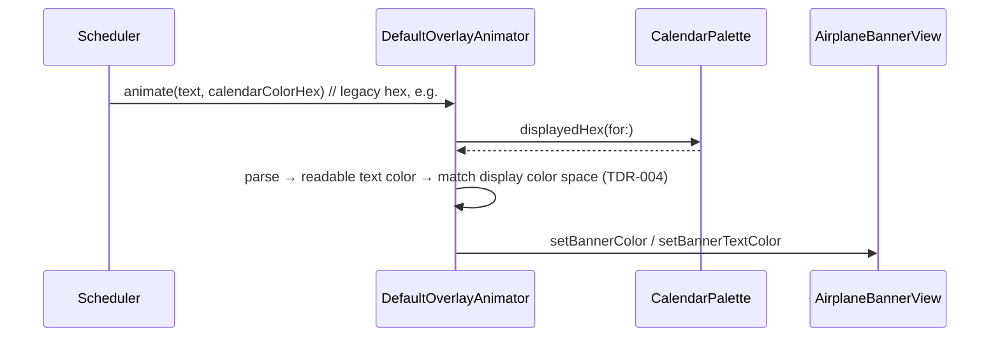

# AYD-012: Banner painted with the Calendar Color **as Google displays it**

> Analysis & Design of the Calendar Color the Banner is painted with (RF-13).
> Supersedes **AYD-006**, which assumed `calendarList.backgroundColor` *is* the color the
> user sees in Google Calendar. It is not: the API serves a legacy palette the UI stopped
> painting years ago, so every Banner comes out in a paler, differently-hued tone than its
> Calendar. This AYD keeps AYD-006's whole structure (color rides on the Trigger, toggle,
> preset fallback, derived text contrast) and changes one thing: the hex is translated to
> the value Google actually paints before it reaches the Banner.

## Goal
Meet **RF-13** as a user reads it: the Banner's color is the **same** color they see on that
Calendar in Google Calendar — not merely a color derived from it. Reported case: a Calendar
set to Google's **Peacock** renders as a deep blue-cyan in Google Calendar and as a pale,
washed-out cyan on the Banner.

## Analysis

### The mismatch is in the value, not in the rendering
Google Calendar has two palettes for the same color names:

- the **legacy palette**, the one the Calendar API returns (`colors.get`'s `calendar`
  section, and — identically — each `calendarList` entry's `backgroundColor`). It is the
  2011-era pastel set: Peacock is `#9fe1e7`.
- the **displayed (Material) palette**, which Google Calendar's web and mobile UI has painted
  since the 2018 redesign. Peacock there is `#039BE5`.

Picking "Peacock" in the UI stores the palette entry; the API keeps reporting the legacy hex
for it and was never migrated. The app decodes `backgroundColor` faithfully (AYD-006) and so
paints `#9fe1e7` — lighter, less saturated and greener than the `#039BE5` the user is
comparing it against. That is the whole defect, and it reproduces for **every** one of the 24
standard Calendar colors, not just Peacock.

### What it is *not*
**TDR-004 is not the cause and stays in force.** A display-color-space mismatch makes a color
come out *more* saturated, never paler, and TDR-004 already converts into the screen's space.
The two fixes are independent and compose: translate the value, then convert it to the
display's color space.

### Custom colors must survive untouched
A Calendar whose color was set outside the standard palette (Google's custom-color picker, or
the API with `colorRgbFormat=true`) already reports the exact hex the UI paints. Translation
must therefore be an **exact-match lookup that passes everything else through** — never a
nearest-color match, which would snap a deliberate custom color onto a palette entry.

### `colors.get` does not help
It returns the same legacy values, so it would cost a request per Poll and change nothing.
AYD-006's "no `colors.get` call" decision stands. The legacy palette is a fixed set of 24
values that has not changed in over a decade; a static table is the right shape for it.

## Affected modules
| Module | Role in this feature | Generated SPEC |
|--------|----------------------|----------------|
| CalendarPalette *(new type)* | Static legacy-hex → displayed-hex table for the 24 standard Calendar colors; pass-through for anything else | SPEC-022 |
| DefaultOverlayAnimator | Translates the Trigger's Calendar Color through `CalendarPalette` while resolving the Banner background, before TDR-004's display-color-space conversion | SPEC-022 |

Everything else is unchanged: no new request, no new scope, no change to `Trigger`,
`OverlayAnimating`, `CalendarService`, the menu, or the architecture topology.

## Interfaces / contract (source of truth)

**CalendarPalette** (new; pure, no AppKit — the table is Google-domain data, not a color op):
```
static func displayedHex(for calendarColorHex: String) -> String
// exact match (case-insensitive, optional leading '#') against the legacy calendar
// palette → the hex Google's UI paints. No match → the input, unchanged.
```

**Color resolution** (AYD-006's rule, with translation inserted):
```
background = matchCalendarColor && parse(displayedHex(calendarColorHex)) ?? preset.color
text       = luminance(background) > threshold ? near-black : white
painted    = background.matchingDisplayColorSpace(screen.colorSpace)   // TDR-004
```

Text contrast is computed on the **translated** color — that is what gets painted. Several
displayed colors are considerably darker than their legacy counterparts (Peacock, Cobalt,
Graphite), so the Banner will now correctly choose white text where it used to choose black.

## The table
Legacy hex is what the API returns; displayed hex is what Google Calendar paints.

| Name | API (legacy) | Displayed |
|------|--------------|-----------|
| Cocoa | `#ac725e` | `#795548` |
| Flamingo | `#d06b64` | `#e67c73` |
| Tomato | `#f83a22` | `#d50000` |
| Tangerine | `#fa573c` | `#f4511e` |
| Pumpkin | `#ff7537` | `#ef6c00` |
| Mango | `#ffad46` | `#f09300` |
| Eucalyptus | `#42d692` | `#009688` |
| Basil | `#16a765` | `#0b8043` |
| Pistachio | `#7bd148` | `#7cb342` |
| Avocado | `#b3dc6c` | `#c0ca33` |
| Citron | `#fbe983` | `#e4c441` |
| Banana | `#fad165` | `#f6bf26` |
| Sage | `#92e1c0` | `#33b679` |
| Peacock | `#9fe1e7` | `#039be5` |
| Cobalt | `#9fc6e7` | `#4285f4` |
| Blueberry | `#4986e7` | `#3f51b5` |
| Lavender | `#9a9cff` | `#7986cb` |
| Wisteria | `#b99aff` | `#b39ddb` |
| Graphite | `#c2c2c2` | `#616161` |
| Birch | `#cabdbf` | `#a79b8e` |
| Radicchio | `#cca6ac` | `#ad1457` |
| Cherry Blossom | `#f691b2` | `#d81b60` |
| Grape | `#cd74e6` | `#8e24aa` |
| Amethyst | `#a47ae2` | `#9e69af` |

## Flow



## Decisions
- **Translate at paint time, not at Poll time.** `Trigger` keeps carrying the hex exactly as
  the API gave it: it stays a faithful domain value, the Trigger contract is untouched, and a
  correction to the table applies to already-armed Triggers with no resync. The single place
  where a hex becomes a painted color is the animator — the same place TDR-004 already acts.
- **Exact match, pass-through default.** Protects custom Calendar colors and makes an unknown
  or future value degrade to today's behavior instead of to a wrong color.
- **No preset changes.** The Banner color presets (RF-08) are the app's own, unrelated to
  Google's palette, and are not translated.

## Non-goals (unchanged from AYD-006)
Per-**Event** color (`event.colorId`, a *third* palette of 11 entries with its own legacy/
displayed split) — an Event colored differently from its Calendar still takes the Calendar's
color. Custom user-defined Banner colors. Coloring the Airplane or the rope.
