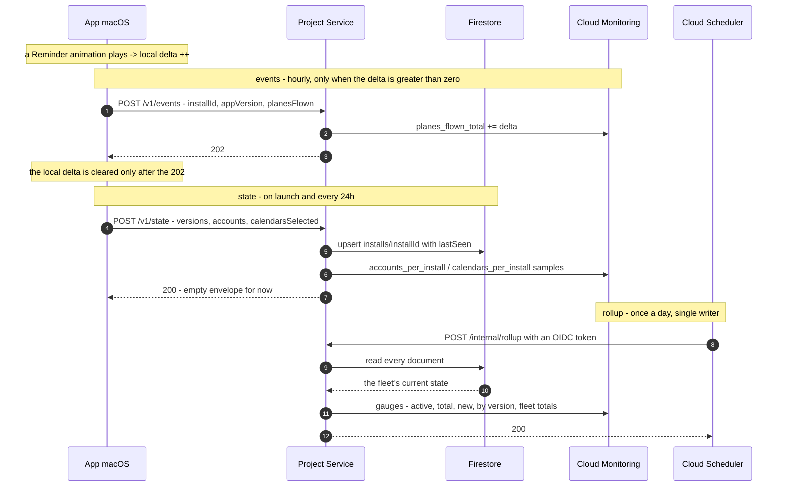

# AYD-012: Observability and the Project Service

> Analysis & Design of the first project-owned backend: what a **Distributed Build** reports,
> what receives it, and how the project turns that into numbers it can look at (RF-17, RF-18,
> RNF-13). It **does not supersede AYD-009** — AYD-009 listed telemetry as a non-goal because
> RNF-12 forbade it at the time; RNF-12 has since been rewritten, and AYD-009's distribution
> design is untouched here (it already anticipated the Appcast moving host: "`SUFeedURL` is the
> only coupling, and it is one string"). Source of the design — the SPECs implement it.

## Goal
Today the project ships an app and then goes blind. Nobody knows how many people run it, on
which version, whether an update was adopted, whether the airplane ever flies, or that it
crashed. RNF-13 asks for those numbers without collecting anything personal; RF-17 and RF-18 say
what the app is allowed to send. This design introduces the **Project Service** — a small Go
service on Cloud Run — and the two report shapes the app sends it.

It also lays the foundation the subscription work will stand on, deliberately and cheaply: the
same service, the same Install identity, the same daily check-in. That is a stated intent, not
scope — no Stripe, no entitlements, no feature lock ships here.

Non-goals: subscriptions and entitlements; the landing page; download and Homebrew counts (they
come from GitHub and Homebrew for free, with no code); any identity that is not a random
per-Install identifier; and any per-event stream — the app reports counts, never a log of what
happened when.

## Analysis

### RNF-12 had to move first, and it did

RNF-12 used to forbid "phone-home" outright, and AYD-009 inherited that as a non-goal. The
requirement has been rewritten because the old wording conflated two different things: **gating**
a capability behind a server, and **measuring** how the app is doing. The first is what "sold on
trust" exists to rule out; the second is ordinary product operation. What survives, and what this
design must not break, is that a **Source Build** is complete and silent: it contacts no
project-owned server, ever, and that is testable rather than promised (RNF-13).

That single rule is why the configuration gate below is the first thing the design decides.

### Metrics cannot count distinct things — so state needs somewhere to live

Cloud Monitoring stores time series of numbers. It has no distinct-count primitive, and the
Install identifier can never become a metric label (cardinality). So "how many Installs are
active" is not derivable from any counter: 37 reports may be 37 Installs or one Install
reporting 37 times.

That question needs something that **remembers which Installs it has seen**. This is state, not
a metric, and it is the whole reason a database appears in a design that is otherwise just
counters.

The tempting alternative is an `UpDownCounter`: the app sends `+1` when an Account is connected,
`-1` when it is disconnected, and the fleet total emerges with no database. It is rejected, and
the reason generalizes into the rule this design is built on:

> A total assembled from deltas **cannot self-heal**. Every delta must arrive exactly once,
> forever. A lost `-1` is wrong permanently; a duplicated `+1` likewise; and an Install that is
> simply deleted never sends its closing deltas at all — so the total counts departed users
> forever, drifting upward systematically rather than randomly.

Contrast an event counter: losing one report loses one animation from one hour's bar. The error
is local and bounded. A running total's error is permanent and cumulative, and after months there
is no way to know how far it has drifted.

Restating absolute state fixes this by construction. Every Install says "I have 2 Accounts now"
once a day; the totals are recomputed from scratch. A lost report is corrected by the next one, a
duplicate overwrites the same document, and an Install that disappears ages out of the count on
its own — because absence is measurable when you hold state, and unrepresentable when you only
accept deltas. A client that has gone away cannot send the event that says so.

### Additive versus population-aggregate — the rule that shapes the endpoints

From the above, each number has exactly one place it can legitimately be produced:

| Shape | Can be published from the request? | Because |
|---|---|---|
| Counter (animations played) | **Yes** | Additive: each request contributes its own delta, and summing deltas across Installs is correct |
| Histogram (Accounts per Install) | **Yes** | Additive: each request contributes one sample |
| Gauge over the population (active Installs, fleet totals, version spread) | **No** | One request sees one Install; the answer is about all of them at once |

A request cannot compute a population aggregate without reading the whole collection, which is
`O(fleet)` work done `O(fleet)` times a day — quadratic, and dead well inside the free tier.
So the aggregate runs **once a day, from a single writer**. That is the rollup, and it is the
only job Cloud Scheduler has here.

This also removes the multi-writer hazard entirely for gauges: a single daily writer never
collides with the "one point per time series per 5 seconds" limit, and never writes out of order.

### Two endpoints, because the two reports have different cadences and different destinations

Events and state want different frequencies — an animation count is only useful at a resolution
finer than a day, while "how many Accounts does this Install have" changes rarely and is a daily
concept. Folding both into one endpoint forces a conditional ("write the database only if the
last write is older than 20 h") that exists purely to reconcile two cadences inside one handler.

Splitting them by cadence removes it, and leaves each handler with one destination:

- **`/v1/events`** — hourly, **only when there is something to report**. Publishes a counter.
  Never touches Firestore.
- **`/v1/state`** — on launch and every 24 h. Writes Firestore, publishes the Accounts and
  Calendars histograms. Publishes no fleet total.

A consequence worth stating because it is load-bearing: since `/v1/events` disappears when the
app is idle, it is **not** a liveness signal. `lastSeen` — and therefore every "active Installs"
number — comes exclusively from `/v1/state`. That is why `/v1/state` fires on launch and on an
elapsed-time check, never at a fixed hour of the day: a Mac that is asleep at 03:00 must still be
counted as active.

### The configuration gate is the Source Build guarantee

`TelemetryConfiguration.make(endpoint:key:)` returns `nil` when either value is absent, exactly
as `UpdateConfiguration.make(feedURL:publicKey:)` already does for Sparkle
(`cal-reminder/Update/UpdateController.swift:14`). With `nil`, no client is constructed, no timer
is scheduled, and no request is made. Both values ride the same road as the OAuth credentials and
the Sparkle keys — an untracked `Secrets.xcconfig`, injected by CI, surfaced through `Info.plist`
(TDR-007, SPEC-018). Whoever clones the repository has neither, so a Source Build is silent
without anyone remembering to make it so.

The key is also what separates a Distributed Build's reports from anonymous noise. It is a static
shared secret in a binary whose source is public, so it authenticates nobody — anyone determined
can extract it with `strings`. That is accepted, deliberately: the goal is to exclude Source
Builds from the numbers and to raise the cost of casual abuse, not to prove provenance. Nothing
commercial will ever be decided from it; the `build_channel` label exists so a future oddity can
be segmented, not trusted. Real per-Install authentication arrives with subscriptions, as a
key pair whose private half never ships.

### What bounds the damage is the instance cap, not the key

A public write endpoint on an autoscaling service turns a flood into an invoice. `--max-instances`
is therefore not a tuning knob but part of the design: with a cap, the worst case is that
Telemetry returns 503, which no user ever notices. Body-size limits, a per-batch event cap and a
per-IP rate limit bound the rest. Cloud Armor would do better and costs money; it is out of scope
until there is a reason.

### Why a direct exporter and not the Collector sidecar

The sibling `personal-finance` project runs an OpenTelemetry Collector as a Cloud Run sidecar and
routes metrics by name prefix to two backends. That pattern is right there and proven, and it is
still **not** what this service starts with: one destination does not need a router, and a second
container costs memory and cold start for a service that handles a few requests per day. The SDK
exports straight to Cloud Monitoring, and Grafana reads Cloud Monitoring as a datasource. The
migration path to the sidecar is one config file when a second destination appears — **TDR-008**.

## Affected modules
| Module | Role in this feature | Generated SPEC |
|--------|----------------------|----------------|
| **Project Service** *(new, `service/`)* | Go service on Cloud Run: `/v1/events`, `/v1/state`, `/v1/crash`, `/internal/rollup`; owns the Firestore collection and the OTel export | SPEC-022 |
| **Firestore** *(new integration)* | One document per Install — the state the rollup aggregates | SPEC-022 |
| **Cloud Monitoring** *(new integration)* | Where every metric lands; Grafana reads it | SPEC-022 |
| **TelemetryClient** *(new, app)* | Holds the Install identifier, accumulates the animation delta, sends both reports, honours the switch and the gate | SPEC-023 |
| **OverlayPresenter** | Reports each Reminder animation played to the TelemetryClient | SPEC-023 |
| **AppCoordinator** | Builds the TelemetryClient from configuration (or does not); supplies the Account and Calendar counts for `/v1/state` | SPEC-023 |
| **MenuBar UI** | States that Telemetry is on and offers the switch; carries the first-launch notice | SPEC-023 |
| **CrashReporter** *(new, app)* | Finds the macOS crash report for its own process, asks, sends | SPEC-024 |

New integrations: the Project Service, Firestore, Cloud Monitoring and Grafana Cloud.
`architecture.md` gains them in the same change.

## Interfaces / contract (source of truth)

**`POST /v1/events`** — hourly, skipped entirely when `planesFlown == 0`
```
{ "installId": "5f3c…", "appVersion": "1.4.2", "planesFlown": 3 }
→ 202 Accepted   (no body)
```

**`POST /v1/state`** — on launch, then every 24 h
```
{ "installId": "5f3c…", "appVersion": "1.4.2", "macosVersion": "15.3",
  "accounts": 2, "calendarsSelected": 5, "buildChannel": "distributed" }
→ 200 { }        (the envelope that will later carry entitlements)
```

**`POST /v1/crash`** — only after the user agrees, one report per request
```
{ "installId": "5f3c…", "appVersion": "1.4.2", "macosVersion": "15.3",
  "report": "<contents of the .ips file>" }
→ 202 Accepted
```

Every app-facing request carries `X-Telemetry-Key: <build-time key>`; a request without it is
rejected with 401 and nothing is recorded.

**`POST /internal/rollup`** — Cloud Scheduler only, OIDC-authenticated, never reachable publicly
```
→ 200 { "installs": 412, "active1d": 180, "active7d": 340, "active30d": 402 }
```

**Firestore — `installs/{installId}`**
```
firstSeen         : timestamp   // set once, on creation
lastSeen          : timestamp   // /v1/state only — the liveness signal
appVersion        : string
macosVersion      : string
accounts          : int         // absolute, restated daily
calendarsSelected : int         // absolute, restated daily
planesTotal       : int         // Increment(delta); convenience only, may drift
buildChannel      : string
```

**Metrics**
| Metric | Kind | Published by | Labels |
|---|---|---|---|
| `planes_flown_total` | counter | `/v1/events` | `app_version` |
| `state_reports_total` | counter | `/v1/state` | `app_version` |
| `crash_reports_total` | counter | `/v1/crash` | `app_version` |
| `accounts_per_install` | histogram | `/v1/state` | `app_version` |
| `calendars_per_install` | histogram | `/v1/state` | `app_version` |
| `installs_total` | gauge | rollup | — |
| `installs_active_1d` / `_7d` / `_30d` | gauge | rollup | — |
| `installs_new_1d` | gauge | rollup | — |
| `installs_by_version` | gauge | rollup | `app_version` |
| `accounts_connected_total` | gauge | rollup | — |
| `calendars_selected_total` | gauge | rollup | — |

`installId` is never a label, on any metric. It exists only inside Firestore and inside a crash
report's storage path.

**App-side configuration gate** — mirrors `UpdateConfiguration`
```
struct TelemetryConfiguration {
    let endpoint: URL
    let key: String
    static func make(endpoint: String?, key: String?) -> TelemetryConfiguration?   // nil when either is absent
}

protocol TelemetryReporting: AnyObject {
    var isConfigured: Bool { get }     // false in a Source Build
    var isEnabled: Bool { get set }    // the menu bar switch (RF-17)
    func recordPlaneFlown()
    func reportStateIfDue() async
}
```

## Affected domain model
- **Install** *(new)* — one copy of the app on one Mac; a random identifier in the Keychain, so
  it survives reinstallation and can later anchor a subscription seat. The unit RNF-13 counts.
- **Telemetry** *(new)* — two report shapes, events and state. Counts and versions only.
- **Project Service** *(new)* — the only project-owned server the app talks to besides the
  Release host.
- Unchanged: Account, Calendar, Event, Reminder, Trigger, Overlay. This design reads two
  existing counts (connected Accounts, selected Calendars) and one existing occurrence (a
  Reminder animation played). It changes nothing about how any of them work.

## Flow



## Decisions
- **Two endpoints split by cadence, not by payload.** It removes the "write the database only if
  stale" conditional and gives each handler a single destination.
- **`lastSeen` comes only from `/v1/state`.** `/v1/events` vanishes when the app is idle, so it
  cannot measure liveness. `/v1/state` therefore fires on launch and on elapsed time, never on a
  wall-clock hour.
- **The animation delta is cleared only after a `202`.** An offline or sleeping Mac accumulates
  and reports late; an animation is never lost, only delayed.
- **Absolute state, never deltas, for anything the dashboard aggregates.** See the rule in
  §Analysis. `planesTotal` in Firestore is the one exception and is explicitly allowed to drift:
  it is a convenience field for "is this Install a heavy user", and no dashboard number is derived
  from it — the animation count comes from the counter metric.
- **The rollup is a single daily writer.** It sidesteps the per-time-series write limit by
  construction rather than by retry logic, and it produces one clean reading a day instead of a
  sawtooth.
- **The rollup reads every document.** Firestore has no `GROUP BY`, and at this scale reading the
  whole collection costs far less than the free daily read quota. Above roughly 10 000 Installs
  this must change — to one aggregation query per known version, or to counters maintained on
  write. Recorded here so the change is made deliberately rather than discovered.
- **Telemetry is on by default and switchable off; a crash report is asked for every time.**
  Pure opt-in under-reports so badly that the numbers stop being usable, and an anonymous count is
  a proportionate default for a paid app that says so on first launch. A crash report is different
  in kind — it is a file whose contents the user should see before it leaves their Mac — so it
  gets a decision per occurrence and never a standing permission.
- **The Install identifier lives in the Keychain, not `UserDefaults`.** It must survive
  reinstallation to make "new Install" mean something, and it is the anchor a subscription seat
  will bind to.
- **No Collector sidecar to start with** — TDR-008.
- **The service lives in `service/`, in this repository, public.** There is nothing secret in it
  beyond environment variables, and a backend anyone can read is the same argument RNF-12 already
  makes about the app. It does make the project multi-part; `conventions.md` §A.1 is updated in
  the same change.

## Out of scope / open questions
- **Out — subscriptions, entitlements and feature locks.** The `/v1/state` response is an empty
  envelope on purpose, so adding them later is additive.
- **Out — per-Install authentication.** The static build-time key excludes Source Builds and
  nothing more, and that is all this design claims. The key pair belongs with subscriptions.
- **Out — the landing page, download counts and Homebrew installs.** GitHub and Homebrew already
  publish those, with no code to write.
- **Out — logs and traces.** Only metrics and crash reports. A log pipeline is a separate
  decision with a separate privacy story.
- **Open — how long crash reports are kept.** A crash report can contain more than a stack (paths,
  loaded libraries). They are stored raw for symbolication, and the retention window is set in
  SPEC-024 rather than here, but it is a privacy-policy fact, not an implementation detail.
- **Open — the ratio between reporting and non-reporting Installs.** Anyone who turns Telemetry
  off is invisible to every number, so all counts are lower bounds. There is no honest way to
  correct for it; the dashboard should say so rather than pretend.
