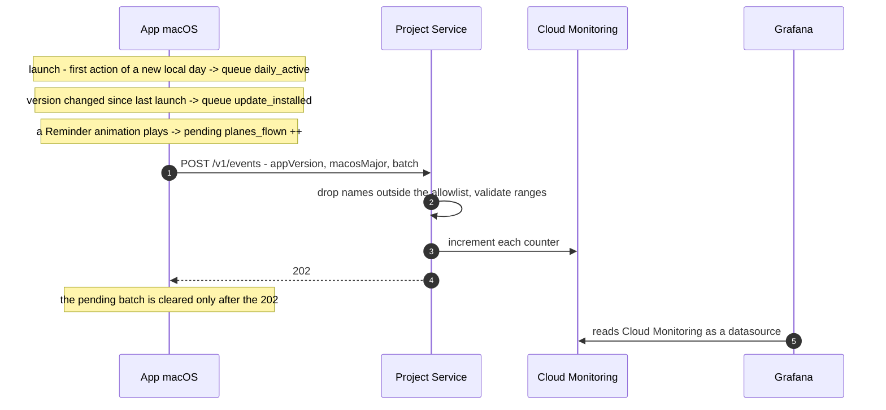

# AYD-012: Observability and the Project Service

> Analysis & Design of the first project-owned backend: what a **Distributed Build** reports,
> what receives it, and how the project turns that into numbers it can look at (RF-17, RF-18,
> RNF-13). It **does not supersede AYD-009** — AYD-009 listed telemetry as a non-goal because
> RNF-12 forbade it at the time; RNF-12 has since been rewritten, and AYD-009's distribution
> design is untouched here. Source of the design — the SPECs implement it.

## Goal
Today the project ships an app and then goes blind. Nobody knows whether anyone opens it, on
which version, whether the airplane ever flies, or that it crashed. This design answers exactly
three questions, and deliberately no more:

1. **How many airplanes flew?** — is the app doing its job, and how often.
2. **How many Installs were used today, on which version?** — is anyone there, and did a release
   get adopted.
3. **How many updates were installed?** — optional, and the same signal seen from the other side.

Plus crash reports (RF-18), which are not a metric.

Non-goals, all of them chosen rather than deferred: counting distinct Installs with any
consistency; 7- and 30-day actives; retention and cohorts; total Installs ever; fleet totals of
Accounts and Calendars; subscriptions and entitlements; the landing page; download and Homebrew
counts (GitHub and Homebrew publish those for free); per-event streams.

## Analysis

### RNF-12 had to move first, and it did

RNF-12 used to forbid "phone-home" outright, and AYD-009 inherited that as a non-goal. The
requirement has been rewritten because the old wording conflated **gating** a capability behind a
server with **measuring** how the app is doing. The first is what "sold on trust" exists to rule
out; the second is ordinary product operation. What survives, and what this design must not
break, is that a **Source Build** is complete and silent: it contacts no project-owned server,
ever, and that is testable rather than promised (RNF-13).

### What counting distinct Installs would have cost

The obvious next question after "how many were used today" is "how many are still around after a
month". Answering it *consistently* requires remembering which Installs have been seen — which
means a per-Install identifier, a database holding one record each, a scheduled job to aggregate
the population, and a definition of "active" baked into that job. That is a database, a cron, a
rollup endpoint, a scale ceiling and a pile of design surface, in service of one class of answer.

This design does not buy it. Retention numbers are worth that machinery for a product with a
growth loop to tune; for a project that mainly needs to know whether anyone is there and whether
a release landed, they are not. **The `installId` is therefore gone entirely** — not stored, not
sent, not generated. With nothing to deduplicate server-side, the reports carry no identifier at
all, which is both less code and a materially better privacy story.

If subscriptions arrive, they bring their own identity (a per-Install key pair whose private half
never ships) and the retention questions become answerable again as a side effect. That is the
right moment to pay for it.

### Everything left is an additive counter

Dropping the population aggregates leaves only numbers that each request can contribute to
directly:

| What | Why it works from the request |
|---|---|
| Airplanes flown | Each report carries a delta; summing deltas across Installs is exactly right |
| Used today | Each Install contributes **at most one** per calendar day (see below), so the daily sum is the number of Installs used that day |
| Update installed | One event per Install per version change |

No value here is a level that goes up and down, so no gauge is published, and nothing needs to see
the whole fleet at once. The consequence is the shape of the whole service: **no database, no
scheduled job, no rollup, no aggregation.** A handler validates a batch, increments counters, and
answers.

### The daily dedupe moves to the client

"Used today" is only a count of Installs if each Install reports it once. That is enforced in the
app: it keeps the last **local calendar day** on which it sent the event, and sends it the first
time it does anything on a new day — a launch, or the first Reminder animation, whichever comes
first. A second launch the same day adds nothing.

Calendar-day, not "24 hours elapsed": elapsed time drifts and can produce two events in one day or
none in another, while a date comparison dedupes exactly. Installs in different time zones smear
the boundary by a few hours, which does not matter at the resolution anyone reads this number.

What the number therefore is, stated honestly so nobody over-reads it: **Installs that opened or
fired at least one Reminder on a given day, among those that have Telemetry switched on.** It is
not unique users, and it is a lower bound.

### One endpoint, an allowlist of names

Every report is now the same shape — a name and a value — so there is one endpoint and one
payload. The metric name is **not** free-form: the service holds an allowlist, and an unknown name
is dropped. A metric name reaching Cloud Monitoring is what creates a time series, so letting a
client invent one is the one place a bad actor could cost real money.

Adding a metric later is one entry in that allowlist plus one call site in the app — no new route,
no new contract.

### The configuration gate is the Source Build guarantee

`TelemetryConfiguration.make(endpoint:key:)` returns `nil` when either value is absent, exactly as
`UpdateConfiguration.make(feedURL:publicKey:)` already does for Sparkle
(`cal-reminder/Update/UpdateController.swift:14`). With `nil`, no client is constructed, no timer
is scheduled, and no request is made. Both values ride the same road as the OAuth credentials and
the Sparkle keys — an untracked `Secrets.xcconfig`, injected by CI, surfaced through `Info.plist`
(TDR-007, SPEC-018). Whoever clones the repository has neither, so a Source Build is silent
without anyone remembering to make it so.

The key also separates a Distributed Build's reports from anonymous noise. It is a static shared
secret in a binary whose source is public, so it authenticates nobody — anyone determined extracts
it with `strings`. That is accepted deliberately: the goal is to exclude Source Builds from the
numbers and to raise the cost of casual abuse, not to prove provenance. Nothing commercial will
ever be decided from it.

### What bounds the damage is the instance cap

A public write endpoint on an autoscaling service turns a flood into an invoice. `--max-instances`
is therefore part of the design, not a tuning knob: with a cap, the worst case is that Telemetry
returns 503, which no user ever notices. A body-size limit, a cap on events per batch and a
per-IP rate limit bound the rest.

### Why a direct exporter and no Collector sidecar

One destination does not need a router, and a sidecar costs memory and cold start on a service
that handles a trickle. The SDK exports straight to Cloud Monitoring; Grafana reads Cloud
Monitoring as a datasource. The migration path is one config file when a second destination
appears — **TDR-008**.

## Affected modules
| Module | Role in this feature | Generated SPEC |
|--------|----------------------|----------------|
| **Project Service** *(new, `service/`)* | Go service on Cloud Run: `/v1/events` and `/v1/crash`; owns the metric allowlist and the OTel export | SPEC-022 |
| **Cloud Monitoring** *(new integration)* | Where every metric lands; Grafana reads it | SPEC-022 |
| **TelemetryClient** *(new, app)* | Accumulates pending events, enforces the once-a-day rule, sends the batch, honours the switch and the gate | SPEC-023 |
| **OverlayPresenter** | Reports each Reminder animation played | SPEC-023 |
| **UpdateController / AppDelegate** | Reports that the running version changed since the last launch | SPEC-023 |
| **AppCoordinator** | Builds the TelemetryClient from configuration, or does not | SPEC-023 |
| **MenuBar UI** | States that Telemetry is on and offers the switch; carries the first-launch notice | SPEC-023 |
| **CrashReporter** *(new, app)* | Finds the macOS crash report for its own process, asks, sends | SPEC-024 |

New integrations: the Project Service, Cloud Monitoring and Grafana Cloud. No database, no
scheduler. `architecture.md` gains them in the same change.

## Interfaces / contract (source of truth)

**`POST /v1/events`** — sent when the pending batch is non-empty, at most hourly
```
{ "appVersion": "1.4.2",
  "macosMajor": "15",
  "events": [ { "name": "planes_flown",     "value": 3 },
              { "name": "daily_active",     "value": 1 },
              { "name": "update_installed", "value": 1 } ] }
→ 202 Accepted   (no body)
```

**Allowlist** — a name outside it is dropped, the rest of the batch still counts
```
planes_flown      counter · label app_version              · value 1..1000
daily_active      counter · labels app_version, macos_major · value == 1
update_installed  counter · label app_version              · value == 1
```

**`POST /v1/crash`** — only after the user agrees, one report per request
```
{ "appVersion": "1.4.2", "macosMajor": "15", "report": "<contents of the .ips file>" }
→ 202 Accepted
```

Every request carries `X-Telemetry-Key: <build-time key>`; without it, 401 and nothing recorded.
**No request carries an identifier of any kind.**

**Metrics**
| Metric | Kind | Labels | Answers |
|---|---|---|---|
| `planes_flown_total` | counter | `app_version` | Airplanes per hour / per day |
| `daily_active_total` | counter | `app_version`, `macos_major` | Installs used that day, and on which version |
| `update_installed_total` | counter | `app_version` | Installs that arrived at a version |
| `crash_reports_total` | counter | `app_version` | Crashes, and where |

**App-side configuration gate** — mirrors `UpdateConfiguration`
```
struct TelemetryConfiguration {
    let endpoint: URL
    let key: String
    static func make(endpoint: String?, key: String?) -> TelemetryConfiguration?   // nil when either is absent
}

protocol TelemetryReporting: AnyObject {
    var isConfigured: Bool { get }     // false in a Source Build
    var isEnabled: Bool { get set }    // the menu bar switch (RF-17)
    func recordPlaneFlown()
    func recordActiveToday()           // no-op when already sent for the current local day
    func recordUpdateInstalled(to version: String)
}
```

## Affected domain model
- **Telemetry** *(new)* — a batch of named counter events. Counts and versions only, no identifier.
- **Project Service** *(new)* — the only project-owned server the app talks to besides the
  Release host.
- **Install** — still the unit being counted, but now counted **without being identified**: the
  app reports at most one "used today" event per Install per day and the service just sums.
- Unchanged: Account, Calendar, Event, Reminder, Trigger, Overlay. This design observes one
  existing occurrence (a Reminder animation played) and changes nothing about any of them.

## Flow



## Decisions
- **No gauges, no database, no scheduled job.** Every number this design publishes is additive, so
  it can be produced from the request that reports it. Everything that required seeing the whole
  fleet at once was cut in §Analysis.
- **No identifier, anywhere.** Nothing to deduplicate server-side means nothing to store, and the
  privacy policy gets to say the reports contain no identifier at all.
- **"Used today" is deduped on the client, by local calendar day.** A date comparison dedupes
  exactly; an elapsed-time rule drifts.
- **The pending batch is cleared only after a `202`.** An offline or sleeping Mac accumulates and
  reports late; an animation is never lost, only delayed.
- **Metric names come from a server-side allowlist.** A client that could invent a name could
  invent time series, and time series cost money.
- **One endpoint for every counter.** Adding a metric is an allowlist entry and a call site.
- **The test animation does not count**, and neither does a relaunch on the same day.
- **`--max-instances` is part of the design**, not an ops detail.
- **The service lives in `service/`, in this repository, public.** Nothing secret in it beyond
  environment variables. It does make the project multi-part; `conventions.md` §A.1 is updated in
  the same change.

## Out of scope / open questions
- **Out — retention, cohorts, 7/30-day actives, total Installs ever.** Cut deliberately; see
  §Analysis. They come back with subscriptions, which bring an identity of their own.
- **Out — Accounts and Calendars per Install.** Interesting once, not worth a field.
- **Out — subscriptions, entitlements, feature locks, per-Install authentication.**
- **Out — logs and traces.** Metrics and crash reports only.
- **Known — every count is a lower bound.** Anyone who switches Telemetry off is invisible, and
  there is no honest way to correct for it. The dashboard should say so rather than pretend.
- **Known — `daily_active_total` is not unique users.** One person with two Macs counts twice; one
  Mac used by two people counts once. Stated on the dashboard.
- **Open — how long crash reports are kept.** Set in SPEC-024, but it is a privacy-policy fact.
